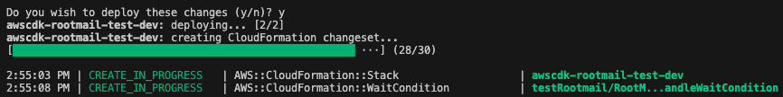
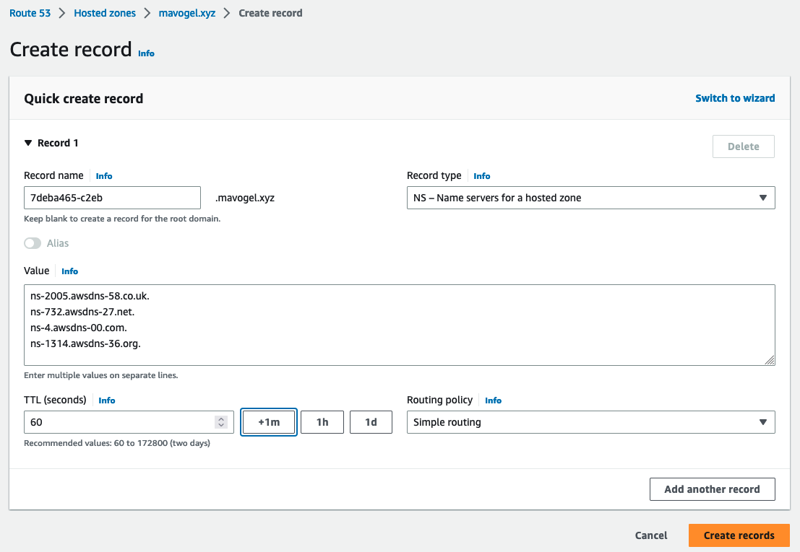

# awscdk-rootmail

See the ADR from superwerker about the rootmail feature [here](https://github.com/superwerker/superwerker/blob/main/docs/adrs/rootmail.md)

## Setup
1. In you `main.ts`
```ts
import { App, Stack, StackProps } from 'aws-cdk-lib';
import { Rootmail, SESReceiveStack } from 'awscdk-rootmail';
import { Construct } from 'constructs';

export class MyStack extends Stack {
  constructor(scope: Construct, id: string, props: StackProps = {}) {
    super(scope, id, props);

    const domain = 'example.com'; // a domain you need to own
    const subdomain = 'aws'; // subdomain which will be created

    const rootmail = new Rootmail(this, 'rootmail-stack', {
      domain: domain,
      subdomain: subdomain,
    });

    new SESReceiveStack(this, 'ses-receive-stack', {
      domain: domain,
      subdomain: subdomain,
      emailbucket: rootmail.emailBucket,
      // SES only supports receiving in certain regions
      // https://docs.aws.amazon.com/ses/latest/dg/regions.html#region-receive-email
      env: {
        region: 'eu-west-1',
      },
    });
  }
}
```
2. run on your commandline
```sh
# projen
npm run deploy -- --all
# plain cdk
npx cdk deploy --all
```
3. watch our for the [cfn wait condition](https://docs.aws.amazon.com/AWSCloudFormation/latest/UserGuide/aws-properties-waitcondition.html)

4. Then create the NS record in your domain `example.com` for the subdomain `aws.example.com`. Here for Route53 in AWS:

5. The `rootmail-ready-handler` Lambda function checks every 5 minutes if the DNS for the subdomain is propagated. You can test it yourself via
```sh
dig +short NS 8.8.8.8 aws.example.com
# should return something like
ns-1111.awsdns-10.org.
ns-2222.awsdns-21.co.uk.
ns-33.awsdns-04.com.
ns-444.awsdns-12.net.
```

## Known issues
- https://github.com/aws/jsii/issues/2071: so adding  `compilerOptions."esModuleInterop": true,` in `tsconfig.json` is not possible. See [aws-sdk](https://docs.aws.amazon.com/AWSJavaScriptSDK/latest/#Usage_with_TypeScript). So change from `import AWS from 'aws-sdk';` to `import * as AWS from 'aws-sdk';`

## Docs
- activate opscenter via [url](https://eu-central-1.console.aws.amazon.com/systems-manager/opsitems/?region=eu-central-1&onboarded=true#activeTab=OPS_ITEMS&list_ops_items_filters=Status:Equal:Open_InProgress)
# API Reference <a name="API Reference" id="api-reference"></a>

## Constructs <a name="Constructs" id="Constructs"></a>

### Rootmail <a name="Rootmail" id="awscdk-rootmail.Rootmail"></a>

#### Initializers <a name="Initializers" id="awscdk-rootmail.Rootmail.Initializer"></a>

```typescript
import { Rootmail } from 'awscdk-rootmail'

new Rootmail(scope: Construct, id: string, props: RootmailProps)
```

| **Name** | **Type** | **Description** |
| --- | --- | --- |
| <code><a href="#awscdk-rootmail.Rootmail.Initializer.parameter.scope">scope</a></code> | <code>constructs.Construct</code> | *No description.* |
| <code><a href="#awscdk-rootmail.Rootmail.Initializer.parameter.id">id</a></code> | <code>string</code> | *No description.* |
| <code><a href="#awscdk-rootmail.Rootmail.Initializer.parameter.props">props</a></code> | <code><a href="#awscdk-rootmail.RootmailProps">RootmailProps</a></code> | *No description.* |

---

##### `scope`<sup>Required</sup> <a name="scope" id="awscdk-rootmail.Rootmail.Initializer.parameter.scope"></a>

- *Type:* constructs.Construct

---

##### `id`<sup>Required</sup> <a name="id" id="awscdk-rootmail.Rootmail.Initializer.parameter.id"></a>

- *Type:* string

---

##### `props`<sup>Required</sup> <a name="props" id="awscdk-rootmail.Rootmail.Initializer.parameter.props"></a>

- *Type:* <a href="#awscdk-rootmail.RootmailProps">RootmailProps</a>

---

#### Methods <a name="Methods" id="Methods"></a>

| **Name** | **Description** |
| --- | --- |
| <code><a href="#awscdk-rootmail.Rootmail.toString">toString</a></code> | Returns a string representation of this construct. |
| <code><a href="#awscdk-rootmail.Rootmail.addDependency">addDependency</a></code> | Add a dependency between this stack and another stack. |
| <code><a href="#awscdk-rootmail.Rootmail.addMetadata">addMetadata</a></code> | Adds an arbitary key-value pair, with information you want to record about the stack. |
| <code><a href="#awscdk-rootmail.Rootmail.addTransform">addTransform</a></code> | Add a Transform to this stack. A Transform is a macro that AWS CloudFormation uses to process your template. |
| <code><a href="#awscdk-rootmail.Rootmail.exportStringListValue">exportStringListValue</a></code> | Create a CloudFormation Export for a string list value. |
| <code><a href="#awscdk-rootmail.Rootmail.exportValue">exportValue</a></code> | Create a CloudFormation Export for a string value. |
| <code><a href="#awscdk-rootmail.Rootmail.formatArn">formatArn</a></code> | Creates an ARN from components. |
| <code><a href="#awscdk-rootmail.Rootmail.getLogicalId">getLogicalId</a></code> | Allocates a stack-unique CloudFormation-compatible logical identity for a specific resource. |
| <code><a href="#awscdk-rootmail.Rootmail.regionalFact">regionalFact</a></code> | Look up a fact value for the given fact for the region of this stack. |
| <code><a href="#awscdk-rootmail.Rootmail.renameLogicalId">renameLogicalId</a></code> | Rename a generated logical identities. |
| <code><a href="#awscdk-rootmail.Rootmail.reportMissingContextKey">reportMissingContextKey</a></code> | Indicate that a context key was expected. |
| <code><a href="#awscdk-rootmail.Rootmail.resolve">resolve</a></code> | Resolve a tokenized value in the context of the current stack. |
| <code><a href="#awscdk-rootmail.Rootmail.splitArn">splitArn</a></code> | Splits the provided ARN into its components. |
| <code><a href="#awscdk-rootmail.Rootmail.toJsonString">toJsonString</a></code> | Convert an object, potentially containing tokens, to a JSON string. |
| <code><a href="#awscdk-rootmail.Rootmail.toYamlString">toYamlString</a></code> | Convert an object, potentially containing tokens, to a YAML string. |

---

##### `toString` <a name="toString" id="awscdk-rootmail.Rootmail.toString"></a>

```typescript
public toString(): string
```

Returns a string representation of this construct.

##### `addDependency` <a name="addDependency" id="awscdk-rootmail.Rootmail.addDependency"></a>

```typescript
public addDependency(target: Stack, reason?: string): void
```

Add a dependency between this stack and another stack.

This can be used to define dependencies between any two stacks within an
app, and also supports nested stacks.

###### `target`<sup>Required</sup> <a name="target" id="awscdk-rootmail.Rootmail.addDependency.parameter.target"></a>

- *Type:* aws-cdk-lib.Stack

---

###### `reason`<sup>Optional</sup> <a name="reason" id="awscdk-rootmail.Rootmail.addDependency.parameter.reason"></a>

- *Type:* string

---

##### `addMetadata` <a name="addMetadata" id="awscdk-rootmail.Rootmail.addMetadata"></a>

```typescript
public addMetadata(key: string, value: any): void
```

Adds an arbitary key-value pair, with information you want to record about the stack.

These get translated to the Metadata section of the generated template.

> [https://docs.aws.amazon.com/AWSCloudFormation/latest/UserGuide/metadata-section-structure.html](https://docs.aws.amazon.com/AWSCloudFormation/latest/UserGuide/metadata-section-structure.html)

###### `key`<sup>Required</sup> <a name="key" id="awscdk-rootmail.Rootmail.addMetadata.parameter.key"></a>

- *Type:* string

---

###### `value`<sup>Required</sup> <a name="value" id="awscdk-rootmail.Rootmail.addMetadata.parameter.value"></a>

- *Type:* any

---

##### `addTransform` <a name="addTransform" id="awscdk-rootmail.Rootmail.addTransform"></a>

```typescript
public addTransform(transform: string): void
```

Add a Transform to this stack. A Transform is a macro that AWS CloudFormation uses to process your template.

Duplicate values are removed when stack is synthesized.

> [https://docs.aws.amazon.com/AWSCloudFormation/latest/UserGuide/transform-section-structure.html](https://docs.aws.amazon.com/AWSCloudFormation/latest/UserGuide/transform-section-structure.html)

*Example*

```typescript
declare const stack: Stack;

stack.addTransform('AWS::Serverless-2016-10-31')
```


###### `transform`<sup>Required</sup> <a name="transform" id="awscdk-rootmail.Rootmail.addTransform.parameter.transform"></a>

- *Type:* string

The transform to add.

---

##### `exportStringListValue` <a name="exportStringListValue" id="awscdk-rootmail.Rootmail.exportStringListValue"></a>

```typescript
public exportStringListValue(exportedValue: any, options?: ExportValueOptions): string[]
```

Create a CloudFormation Export for a string list value.

Returns a string list representing the corresponding `Fn.importValue()`
expression for this Export. The export expression is automatically wrapped with an
`Fn::Join` and the import value with an `Fn::Split`, since CloudFormation can only
export strings. You can control the name for the export by passing the `name` option.

If you don't supply a value for `name`, the value you're exporting must be
a Resource attribute (for example: `bucket.bucketName`) and it will be
given the same name as the automatic cross-stack reference that would be created
if you used the attribute in another Stack.

One of the uses for this method is to *remove* the relationship between
two Stacks established by automatic cross-stack references. It will
temporarily ensure that the CloudFormation Export still exists while you
remove the reference from the consuming stack. After that, you can remove
the resource and the manual export.

See `exportValue` for an example of this process.

###### `exportedValue`<sup>Required</sup> <a name="exportedValue" id="awscdk-rootmail.Rootmail.exportStringListValue.parameter.exportedValue"></a>

- *Type:* any

---

###### `options`<sup>Optional</sup> <a name="options" id="awscdk-rootmail.Rootmail.exportStringListValue.parameter.options"></a>

- *Type:* aws-cdk-lib.ExportValueOptions

---

##### `exportValue` <a name="exportValue" id="awscdk-rootmail.Rootmail.exportValue"></a>

```typescript
public exportValue(exportedValue: any, options?: ExportValueOptions): string
```

Create a CloudFormation Export for a string value.

Returns a string representing the corresponding `Fn.importValue()`
expression for this Export. You can control the name for the export by
passing the `name` option.

If you don't supply a value for `name`, the value you're exporting must be
a Resource attribute (for example: `bucket.bucketName`) and it will be
given the same name as the automatic cross-stack reference that would be created
if you used the attribute in another Stack.

One of the uses for this method is to *remove* the relationship between
two Stacks established by automatic cross-stack references. It will
temporarily ensure that the CloudFormation Export still exists while you
remove the reference from the consuming stack. After that, you can remove
the resource and the manual export.

## Example

Here is how the process works. Let's say there are two stacks,
`producerStack` and `consumerStack`, and `producerStack` has a bucket
called `bucket`, which is referenced by `consumerStack` (perhaps because
an AWS Lambda Function writes into it, or something like that).

It is not safe to remove `producerStack.bucket` because as the bucket is being
deleted, `consumerStack` might still be using it.

Instead, the process takes two deployments:

### Deployment 1: break the relationship

- Make sure `consumerStack` no longer references `bucket.bucketName` (maybe the consumer
  stack now uses its own bucket, or it writes to an AWS DynamoDB table, or maybe you just
  remove the Lambda Function altogether).
- In the `ProducerStack` class, call `this.exportValue(this.bucket.bucketName)`. This
  will make sure the CloudFormation Export continues to exist while the relationship
  between the two stacks is being broken.
- Deploy (this will effectively only change the `consumerStack`, but it's safe to deploy both).

### Deployment 2: remove the bucket resource

- You are now free to remove the `bucket` resource from `producerStack`.
- Don't forget to remove the `exportValue()` call as well.
- Deploy again (this time only the `producerStack` will be changed -- the bucket will be deleted).

###### `exportedValue`<sup>Required</sup> <a name="exportedValue" id="awscdk-rootmail.Rootmail.exportValue.parameter.exportedValue"></a>

- *Type:* any

---

###### `options`<sup>Optional</sup> <a name="options" id="awscdk-rootmail.Rootmail.exportValue.parameter.options"></a>

- *Type:* aws-cdk-lib.ExportValueOptions

---

##### `formatArn` <a name="formatArn" id="awscdk-rootmail.Rootmail.formatArn"></a>

```typescript
public formatArn(components: ArnComponents): string
```

Creates an ARN from components.

If `partition`, `region` or `account` are not specified, the stack's
partition, region and account will be used.

If any component is the empty string, an empty string will be inserted
into the generated ARN at the location that component corresponds to.

The ARN will be formatted as follows:

  arn:{partition}:{service}:{region}:{account}:{resource}{sep}{resource-name}

The required ARN pieces that are omitted will be taken from the stack that
the 'scope' is attached to. If all ARN pieces are supplied, the supplied scope
can be 'undefined'.

###### `components`<sup>Required</sup> <a name="components" id="awscdk-rootmail.Rootmail.formatArn.parameter.components"></a>

- *Type:* aws-cdk-lib.ArnComponents

---

##### `getLogicalId` <a name="getLogicalId" id="awscdk-rootmail.Rootmail.getLogicalId"></a>

```typescript
public getLogicalId(element: CfnElement): string
```

Allocates a stack-unique CloudFormation-compatible logical identity for a specific resource.

This method is called when a `CfnElement` is created and used to render the
initial logical identity of resources. Logical ID renames are applied at
this stage.

This method uses the protected method `allocateLogicalId` to render the
logical ID for an element. To modify the naming scheme, extend the `Stack`
class and override this method.

###### `element`<sup>Required</sup> <a name="element" id="awscdk-rootmail.Rootmail.getLogicalId.parameter.element"></a>

- *Type:* aws-cdk-lib.CfnElement

The CloudFormation element for which a logical identity is needed.

---

##### `regionalFact` <a name="regionalFact" id="awscdk-rootmail.Rootmail.regionalFact"></a>

```typescript
public regionalFact(factName: string, defaultValue?: string): string
```

Look up a fact value for the given fact for the region of this stack.

Will return a definite value only if the region of the current stack is resolved.
If not, a lookup map will be added to the stack and the lookup will be done at
CDK deployment time.

What regions will be included in the lookup map is controlled by the
`@aws-cdk/core:target-partitions` context value: it must be set to a list
of partitions, and only regions from the given partitions will be included.
If no such context key is set, all regions will be included.

This function is intended to be used by construct library authors. Application
builders can rely on the abstractions offered by construct libraries and do
not have to worry about regional facts.

If `defaultValue` is not given, it is an error if the fact is unknown for
the given region.

###### `factName`<sup>Required</sup> <a name="factName" id="awscdk-rootmail.Rootmail.regionalFact.parameter.factName"></a>

- *Type:* string

---

###### `defaultValue`<sup>Optional</sup> <a name="defaultValue" id="awscdk-rootmail.Rootmail.regionalFact.parameter.defaultValue"></a>

- *Type:* string

---

##### `renameLogicalId` <a name="renameLogicalId" id="awscdk-rootmail.Rootmail.renameLogicalId"></a>

```typescript
public renameLogicalId(oldId: string, newId: string): void
```

Rename a generated logical identities.

To modify the naming scheme strategy, extend the `Stack` class and
override the `allocateLogicalId` method.

###### `oldId`<sup>Required</sup> <a name="oldId" id="awscdk-rootmail.Rootmail.renameLogicalId.parameter.oldId"></a>

- *Type:* string

---

###### `newId`<sup>Required</sup> <a name="newId" id="awscdk-rootmail.Rootmail.renameLogicalId.parameter.newId"></a>

- *Type:* string

---

##### `reportMissingContextKey` <a name="reportMissingContextKey" id="awscdk-rootmail.Rootmail.reportMissingContextKey"></a>

```typescript
public reportMissingContextKey(report: MissingContext): void
```

Indicate that a context key was expected.

Contains instructions which will be emitted into the cloud assembly on how
the key should be supplied.

###### `report`<sup>Required</sup> <a name="report" id="awscdk-rootmail.Rootmail.reportMissingContextKey.parameter.report"></a>

- *Type:* aws-cdk-lib.cloud_assembly_schema.MissingContext

The set of parameters needed to obtain the context.

---

##### `resolve` <a name="resolve" id="awscdk-rootmail.Rootmail.resolve"></a>

```typescript
public resolve(obj: any): any
```

Resolve a tokenized value in the context of the current stack.

###### `obj`<sup>Required</sup> <a name="obj" id="awscdk-rootmail.Rootmail.resolve.parameter.obj"></a>

- *Type:* any

---

##### `splitArn` <a name="splitArn" id="awscdk-rootmail.Rootmail.splitArn"></a>

```typescript
public splitArn(arn: string, arnFormat: ArnFormat): ArnComponents
```

Splits the provided ARN into its components.

Works both if 'arn' is a string like 'arn:aws:s3:::bucket',
and a Token representing a dynamic CloudFormation expression
(in which case the returned components will also be dynamic CloudFormation expressions,
encoded as Tokens).

###### `arn`<sup>Required</sup> <a name="arn" id="awscdk-rootmail.Rootmail.splitArn.parameter.arn"></a>

- *Type:* string

the ARN to split into its components.

---

###### `arnFormat`<sup>Required</sup> <a name="arnFormat" id="awscdk-rootmail.Rootmail.splitArn.parameter.arnFormat"></a>

- *Type:* aws-cdk-lib.ArnFormat

the expected format of 'arn' - depends on what format the service 'arn' represents uses.

---

##### `toJsonString` <a name="toJsonString" id="awscdk-rootmail.Rootmail.toJsonString"></a>

```typescript
public toJsonString(obj: any, space?: number): string
```

Convert an object, potentially containing tokens, to a JSON string.

###### `obj`<sup>Required</sup> <a name="obj" id="awscdk-rootmail.Rootmail.toJsonString.parameter.obj"></a>

- *Type:* any

---

###### `space`<sup>Optional</sup> <a name="space" id="awscdk-rootmail.Rootmail.toJsonString.parameter.space"></a>

- *Type:* number

---

##### `toYamlString` <a name="toYamlString" id="awscdk-rootmail.Rootmail.toYamlString"></a>

```typescript
public toYamlString(obj: any): string
```

Convert an object, potentially containing tokens, to a YAML string.

###### `obj`<sup>Required</sup> <a name="obj" id="awscdk-rootmail.Rootmail.toYamlString.parameter.obj"></a>

- *Type:* any

---

#### Static Functions <a name="Static Functions" id="Static Functions"></a>

| **Name** | **Description** |
| --- | --- |
| <code><a href="#awscdk-rootmail.Rootmail.isConstruct">isConstruct</a></code> | Checks if `x` is a construct. |
| <code><a href="#awscdk-rootmail.Rootmail.isStack">isStack</a></code> | Return whether the given object is a Stack. |
| <code><a href="#awscdk-rootmail.Rootmail.of">of</a></code> | Looks up the first stack scope in which `construct` is defined. |

---

##### ~~`isConstruct`~~ <a name="isConstruct" id="awscdk-rootmail.Rootmail.isConstruct"></a>

```typescript
import { Rootmail } from 'awscdk-rootmail'

Rootmail.isConstruct(x: any)
```

Checks if `x` is a construct.

###### `x`<sup>Required</sup> <a name="x" id="awscdk-rootmail.Rootmail.isConstruct.parameter.x"></a>

- *Type:* any

Any object.

---

##### `isStack` <a name="isStack" id="awscdk-rootmail.Rootmail.isStack"></a>

```typescript
import { Rootmail } from 'awscdk-rootmail'

Rootmail.isStack(x: any)
```

Return whether the given object is a Stack.

We do attribute detection since we can't reliably use 'instanceof'.

###### `x`<sup>Required</sup> <a name="x" id="awscdk-rootmail.Rootmail.isStack.parameter.x"></a>

- *Type:* any

---

##### `of` <a name="of" id="awscdk-rootmail.Rootmail.of"></a>

```typescript
import { Rootmail } from 'awscdk-rootmail'

Rootmail.of(construct: IConstruct)
```

Looks up the first stack scope in which `construct` is defined.

Fails if there is no stack up the tree.

###### `construct`<sup>Required</sup> <a name="construct" id="awscdk-rootmail.Rootmail.of.parameter.construct"></a>

- *Type:* constructs.IConstruct

The construct to start the search from.

---

#### Properties <a name="Properties" id="Properties"></a>

| **Name** | **Type** | **Description** |
| --- | --- | --- |
| <code><a href="#awscdk-rootmail.Rootmail.property.node">node</a></code> | <code>constructs.Node</code> | The tree node. |
| <code><a href="#awscdk-rootmail.Rootmail.property.account">account</a></code> | <code>string</code> | The AWS account into which this stack will be deployed. |
| <code><a href="#awscdk-rootmail.Rootmail.property.artifactId">artifactId</a></code> | <code>string</code> | The ID of the cloud assembly artifact for this stack. |
| <code><a href="#awscdk-rootmail.Rootmail.property.availabilityZones">availabilityZones</a></code> | <code>string[]</code> | Returns the list of AZs that are available in the AWS environment (account/region) associated with this stack. |
| <code><a href="#awscdk-rootmail.Rootmail.property.bundlingRequired">bundlingRequired</a></code> | <code>boolean</code> | Indicates whether the stack requires bundling or not. |
| <code><a href="#awscdk-rootmail.Rootmail.property.dependencies">dependencies</a></code> | <code>aws-cdk-lib.Stack[]</code> | Return the stacks this stack depends on. |
| <code><a href="#awscdk-rootmail.Rootmail.property.environment">environment</a></code> | <code>string</code> | The environment coordinates in which this stack is deployed. |
| <code><a href="#awscdk-rootmail.Rootmail.property.nested">nested</a></code> | <code>boolean</code> | Indicates if this is a nested stack, in which case `parentStack` will include a reference to it's parent. |
| <code><a href="#awscdk-rootmail.Rootmail.property.notificationArns">notificationArns</a></code> | <code>string[]</code> | Returns the list of notification Amazon Resource Names (ARNs) for the current stack. |
| <code><a href="#awscdk-rootmail.Rootmail.property.partition">partition</a></code> | <code>string</code> | The partition in which this stack is defined. |
| <code><a href="#awscdk-rootmail.Rootmail.property.region">region</a></code> | <code>string</code> | The AWS region into which this stack will be deployed (e.g. `us-west-2`). |
| <code><a href="#awscdk-rootmail.Rootmail.property.stackId">stackId</a></code> | <code>string</code> | The ID of the stack. |
| <code><a href="#awscdk-rootmail.Rootmail.property.stackName">stackName</a></code> | <code>string</code> | The concrete CloudFormation physical stack name. |
| <code><a href="#awscdk-rootmail.Rootmail.property.synthesizer">synthesizer</a></code> | <code>aws-cdk-lib.IStackSynthesizer</code> | Synthesis method for this stack. |
| <code><a href="#awscdk-rootmail.Rootmail.property.tags">tags</a></code> | <code>aws-cdk-lib.TagManager</code> | Tags to be applied to the stack. |
| <code><a href="#awscdk-rootmail.Rootmail.property.templateFile">templateFile</a></code> | <code>string</code> | The name of the CloudFormation template file emitted to the output directory during synthesis. |
| <code><a href="#awscdk-rootmail.Rootmail.property.templateOptions">templateOptions</a></code> | <code>aws-cdk-lib.ITemplateOptions</code> | Options for CloudFormation template (like version, transform, description). |
| <code><a href="#awscdk-rootmail.Rootmail.property.urlSuffix">urlSuffix</a></code> | <code>string</code> | The Amazon domain suffix for the region in which this stack is defined. |
| <code><a href="#awscdk-rootmail.Rootmail.property.nestedStackParent">nestedStackParent</a></code> | <code>aws-cdk-lib.Stack</code> | If this is a nested stack, returns it's parent stack. |
| <code><a href="#awscdk-rootmail.Rootmail.property.nestedStackResource">nestedStackResource</a></code> | <code>aws-cdk-lib.CfnResource</code> | If this is a nested stack, this represents its `AWS::CloudFormation::Stack` resource. |
| <code><a href="#awscdk-rootmail.Rootmail.property.terminationProtection">terminationProtection</a></code> | <code>boolean</code> | Whether termination protection is enabled for this stack. |
| <code><a href="#awscdk-rootmail.Rootmail.property.emailBucket">emailBucket</a></code> | <code>aws-cdk-lib.aws_s3.Bucket</code> | *No description.* |
| <code><a href="#awscdk-rootmail.Rootmail.property.hostedZoneParameterName">hostedZoneParameterName</a></code> | <code>string</code> | *No description.* |
| <code><a href="#awscdk-rootmail.Rootmail.property.rootMailReadyEventRule">rootMailReadyEventRule</a></code> | <code>aws-cdk-lib.aws_events.Rule</code> | *No description.* |

---

##### `node`<sup>Required</sup> <a name="node" id="awscdk-rootmail.Rootmail.property.node"></a>

```typescript
public readonly node: Node;
```

- *Type:* constructs.Node

The tree node.

---

##### `account`<sup>Required</sup> <a name="account" id="awscdk-rootmail.Rootmail.property.account"></a>

```typescript
public readonly account: string;
```

- *Type:* string

The AWS account into which this stack will be deployed.

This value is resolved according to the following rules:

1. The value provided to `env.account` when the stack is defined. This can
   either be a concrete account (e.g. `585695031111`) or the
   `Aws.ACCOUNT_ID` token.
3. `Aws.ACCOUNT_ID`, which represents the CloudFormation intrinsic reference
   `{ "Ref": "AWS::AccountId" }` encoded as a string token.

Preferably, you should use the return value as an opaque string and not
attempt to parse it to implement your logic. If you do, you must first
check that it is a concrete value an not an unresolved token. If this
value is an unresolved token (`Token.isUnresolved(stack.account)` returns
`true`), this implies that the user wishes that this stack will synthesize
into a **account-agnostic template**. In this case, your code should either
fail (throw an error, emit a synth error using `Annotations.of(construct).addError()`) or
implement some other region-agnostic behavior.

---

##### `artifactId`<sup>Required</sup> <a name="artifactId" id="awscdk-rootmail.Rootmail.property.artifactId"></a>

```typescript
public readonly artifactId: string;
```

- *Type:* string

The ID of the cloud assembly artifact for this stack.

---

##### `availabilityZones`<sup>Required</sup> <a name="availabilityZones" id="awscdk-rootmail.Rootmail.property.availabilityZones"></a>

```typescript
public readonly availabilityZones: string[];
```

- *Type:* string[]

Returns the list of AZs that are available in the AWS environment (account/region) associated with this stack.

If the stack is environment-agnostic (either account and/or region are
tokens), this property will return an array with 2 tokens that will resolve
at deploy-time to the first two availability zones returned from CloudFormation's
`Fn::GetAZs` intrinsic function.

If they are not available in the context, returns a set of dummy values and
reports them as missing, and let the CLI resolve them by calling EC2
`DescribeAvailabilityZones` on the target environment.

To specify a different strategy for selecting availability zones override this method.

---

##### `bundlingRequired`<sup>Required</sup> <a name="bundlingRequired" id="awscdk-rootmail.Rootmail.property.bundlingRequired"></a>

```typescript
public readonly bundlingRequired: boolean;
```

- *Type:* boolean

Indicates whether the stack requires bundling or not.

---

##### `dependencies`<sup>Required</sup> <a name="dependencies" id="awscdk-rootmail.Rootmail.property.dependencies"></a>

```typescript
public readonly dependencies: Stack[];
```

- *Type:* aws-cdk-lib.Stack[]

Return the stacks this stack depends on.

---

##### `environment`<sup>Required</sup> <a name="environment" id="awscdk-rootmail.Rootmail.property.environment"></a>

```typescript
public readonly environment: string;
```

- *Type:* string

The environment coordinates in which this stack is deployed.

In the form
`aws://account/region`. Use `stack.account` and `stack.region` to obtain
the specific values, no need to parse.

You can use this value to determine if two stacks are targeting the same
environment.

If either `stack.account` or `stack.region` are not concrete values (e.g.
`Aws.ACCOUNT_ID` or `Aws.REGION`) the special strings `unknown-account` and/or
`unknown-region` will be used respectively to indicate this stack is
region/account-agnostic.

---

##### `nested`<sup>Required</sup> <a name="nested" id="awscdk-rootmail.Rootmail.property.nested"></a>

```typescript
public readonly nested: boolean;
```

- *Type:* boolean

Indicates if this is a nested stack, in which case `parentStack` will include a reference to it's parent.

---

##### `notificationArns`<sup>Required</sup> <a name="notificationArns" id="awscdk-rootmail.Rootmail.property.notificationArns"></a>

```typescript
public readonly notificationArns: string[];
```

- *Type:* string[]

Returns the list of notification Amazon Resource Names (ARNs) for the current stack.

---

##### `partition`<sup>Required</sup> <a name="partition" id="awscdk-rootmail.Rootmail.property.partition"></a>

```typescript
public readonly partition: string;
```

- *Type:* string

The partition in which this stack is defined.

---

##### `region`<sup>Required</sup> <a name="region" id="awscdk-rootmail.Rootmail.property.region"></a>

```typescript
public readonly region: string;
```

- *Type:* string

The AWS region into which this stack will be deployed (e.g. `us-west-2`).

This value is resolved according to the following rules:

1. The value provided to `env.region` when the stack is defined. This can
   either be a concrete region (e.g. `us-west-2`) or the `Aws.REGION`
   token.
3. `Aws.REGION`, which is represents the CloudFormation intrinsic reference
   `{ "Ref": "AWS::Region" }` encoded as a string token.

Preferably, you should use the return value as an opaque string and not
attempt to parse it to implement your logic. If you do, you must first
check that it is a concrete value an not an unresolved token. If this
value is an unresolved token (`Token.isUnresolved(stack.region)` returns
`true`), this implies that the user wishes that this stack will synthesize
into a **region-agnostic template**. In this case, your code should either
fail (throw an error, emit a synth error using `Annotations.of(construct).addError()`) or
implement some other region-agnostic behavior.

---

##### `stackId`<sup>Required</sup> <a name="stackId" id="awscdk-rootmail.Rootmail.property.stackId"></a>

```typescript
public readonly stackId: string;
```

- *Type:* string

The ID of the stack.

---

*Example*

```typescript
// After resolving, looks like
'arn:aws:cloudformation:us-west-2:123456789012:stack/teststack/51af3dc0-da77-11e4-872e-1234567db123'
```


##### `stackName`<sup>Required</sup> <a name="stackName" id="awscdk-rootmail.Rootmail.property.stackName"></a>

```typescript
public readonly stackName: string;
```

- *Type:* string

The concrete CloudFormation physical stack name.

This is either the name defined explicitly in the `stackName` prop or
allocated based on the stack's location in the construct tree. Stacks that
are directly defined under the app use their construct `id` as their stack
name. Stacks that are defined deeper within the tree will use a hashed naming
scheme based on the construct path to ensure uniqueness.

If you wish to obtain the deploy-time AWS::StackName intrinsic,
you can use `Aws.STACK_NAME` directly.

---

##### `synthesizer`<sup>Required</sup> <a name="synthesizer" id="awscdk-rootmail.Rootmail.property.synthesizer"></a>

```typescript
public readonly synthesizer: IStackSynthesizer;
```

- *Type:* aws-cdk-lib.IStackSynthesizer

Synthesis method for this stack.

---

##### `tags`<sup>Required</sup> <a name="tags" id="awscdk-rootmail.Rootmail.property.tags"></a>

```typescript
public readonly tags: TagManager;
```

- *Type:* aws-cdk-lib.TagManager

Tags to be applied to the stack.

---

##### `templateFile`<sup>Required</sup> <a name="templateFile" id="awscdk-rootmail.Rootmail.property.templateFile"></a>

```typescript
public readonly templateFile: string;
```

- *Type:* string

The name of the CloudFormation template file emitted to the output directory during synthesis.

Example value: `MyStack.template.json`

---

##### `templateOptions`<sup>Required</sup> <a name="templateOptions" id="awscdk-rootmail.Rootmail.property.templateOptions"></a>

```typescript
public readonly templateOptions: ITemplateOptions;
```

- *Type:* aws-cdk-lib.ITemplateOptions

Options for CloudFormation template (like version, transform, description).

---

##### `urlSuffix`<sup>Required</sup> <a name="urlSuffix" id="awscdk-rootmail.Rootmail.property.urlSuffix"></a>

```typescript
public readonly urlSuffix: string;
```

- *Type:* string

The Amazon domain suffix for the region in which this stack is defined.

---

##### `nestedStackParent`<sup>Optional</sup> <a name="nestedStackParent" id="awscdk-rootmail.Rootmail.property.nestedStackParent"></a>

```typescript
public readonly nestedStackParent: Stack;
```

- *Type:* aws-cdk-lib.Stack

If this is a nested stack, returns it's parent stack.

---

##### `nestedStackResource`<sup>Optional</sup> <a name="nestedStackResource" id="awscdk-rootmail.Rootmail.property.nestedStackResource"></a>

```typescript
public readonly nestedStackResource: CfnResource;
```

- *Type:* aws-cdk-lib.CfnResource

If this is a nested stack, this represents its `AWS::CloudFormation::Stack` resource.

`undefined` for top-level (non-nested) stacks.

---

##### `terminationProtection`<sup>Optional</sup> <a name="terminationProtection" id="awscdk-rootmail.Rootmail.property.terminationProtection"></a>

```typescript
public readonly terminationProtection: boolean;
```

- *Type:* boolean

Whether termination protection is enabled for this stack.

---

##### `emailBucket`<sup>Required</sup> <a name="emailBucket" id="awscdk-rootmail.Rootmail.property.emailBucket"></a>

```typescript
public readonly emailBucket: Bucket;
```

- *Type:* aws-cdk-lib.aws_s3.Bucket

---

##### `hostedZoneParameterName`<sup>Required</sup> <a name="hostedZoneParameterName" id="awscdk-rootmail.Rootmail.property.hostedZoneParameterName"></a>

```typescript
public readonly hostedZoneParameterName: string;
```

- *Type:* string

---

##### `rootMailReadyEventRule`<sup>Required</sup> <a name="rootMailReadyEventRule" id="awscdk-rootmail.Rootmail.property.rootMailReadyEventRule"></a>

```typescript
public readonly rootMailReadyEventRule: Rule;
```

- *Type:* aws-cdk-lib.aws_events.Rule

---


### SESReceiveStack <a name="SESReceiveStack" id="awscdk-rootmail.SESReceiveStack"></a>

#### Initializers <a name="Initializers" id="awscdk-rootmail.SESReceiveStack.Initializer"></a>

```typescript
import { SESReceiveStack } from 'awscdk-rootmail'

new SESReceiveStack(scope: Construct, id: string, props: SESReceiveStackProps)
```

| **Name** | **Type** | **Description** |
| --- | --- | --- |
| <code><a href="#awscdk-rootmail.SESReceiveStack.Initializer.parameter.scope">scope</a></code> | <code>constructs.Construct</code> | *No description.* |
| <code><a href="#awscdk-rootmail.SESReceiveStack.Initializer.parameter.id">id</a></code> | <code>string</code> | *No description.* |
| <code><a href="#awscdk-rootmail.SESReceiveStack.Initializer.parameter.props">props</a></code> | <code><a href="#awscdk-rootmail.SESReceiveStackProps">SESReceiveStackProps</a></code> | *No description.* |

---

##### `scope`<sup>Required</sup> <a name="scope" id="awscdk-rootmail.SESReceiveStack.Initializer.parameter.scope"></a>

- *Type:* constructs.Construct

---

##### `id`<sup>Required</sup> <a name="id" id="awscdk-rootmail.SESReceiveStack.Initializer.parameter.id"></a>

- *Type:* string

---

##### `props`<sup>Required</sup> <a name="props" id="awscdk-rootmail.SESReceiveStack.Initializer.parameter.props"></a>

- *Type:* <a href="#awscdk-rootmail.SESReceiveStackProps">SESReceiveStackProps</a>

---

#### Methods <a name="Methods" id="Methods"></a>

| **Name** | **Description** |
| --- | --- |
| <code><a href="#awscdk-rootmail.SESReceiveStack.toString">toString</a></code> | Returns a string representation of this construct. |
| <code><a href="#awscdk-rootmail.SESReceiveStack.addDependency">addDependency</a></code> | Add a dependency between this stack and another stack. |
| <code><a href="#awscdk-rootmail.SESReceiveStack.addMetadata">addMetadata</a></code> | Adds an arbitary key-value pair, with information you want to record about the stack. |
| <code><a href="#awscdk-rootmail.SESReceiveStack.addTransform">addTransform</a></code> | Add a Transform to this stack. A Transform is a macro that AWS CloudFormation uses to process your template. |
| <code><a href="#awscdk-rootmail.SESReceiveStack.exportStringListValue">exportStringListValue</a></code> | Create a CloudFormation Export for a string list value. |
| <code><a href="#awscdk-rootmail.SESReceiveStack.exportValue">exportValue</a></code> | Create a CloudFormation Export for a string value. |
| <code><a href="#awscdk-rootmail.SESReceiveStack.formatArn">formatArn</a></code> | Creates an ARN from components. |
| <code><a href="#awscdk-rootmail.SESReceiveStack.getLogicalId">getLogicalId</a></code> | Allocates a stack-unique CloudFormation-compatible logical identity for a specific resource. |
| <code><a href="#awscdk-rootmail.SESReceiveStack.regionalFact">regionalFact</a></code> | Look up a fact value for the given fact for the region of this stack. |
| <code><a href="#awscdk-rootmail.SESReceiveStack.renameLogicalId">renameLogicalId</a></code> | Rename a generated logical identities. |
| <code><a href="#awscdk-rootmail.SESReceiveStack.reportMissingContextKey">reportMissingContextKey</a></code> | Indicate that a context key was expected. |
| <code><a href="#awscdk-rootmail.SESReceiveStack.resolve">resolve</a></code> | Resolve a tokenized value in the context of the current stack. |
| <code><a href="#awscdk-rootmail.SESReceiveStack.splitArn">splitArn</a></code> | Splits the provided ARN into its components. |
| <code><a href="#awscdk-rootmail.SESReceiveStack.toJsonString">toJsonString</a></code> | Convert an object, potentially containing tokens, to a JSON string. |
| <code><a href="#awscdk-rootmail.SESReceiveStack.toYamlString">toYamlString</a></code> | Convert an object, potentially containing tokens, to a YAML string. |

---

##### `toString` <a name="toString" id="awscdk-rootmail.SESReceiveStack.toString"></a>

```typescript
public toString(): string
```

Returns a string representation of this construct.

##### `addDependency` <a name="addDependency" id="awscdk-rootmail.SESReceiveStack.addDependency"></a>

```typescript
public addDependency(target: Stack, reason?: string): void
```

Add a dependency between this stack and another stack.

This can be used to define dependencies between any two stacks within an
app, and also supports nested stacks.

###### `target`<sup>Required</sup> <a name="target" id="awscdk-rootmail.SESReceiveStack.addDependency.parameter.target"></a>

- *Type:* aws-cdk-lib.Stack

---

###### `reason`<sup>Optional</sup> <a name="reason" id="awscdk-rootmail.SESReceiveStack.addDependency.parameter.reason"></a>

- *Type:* string

---

##### `addMetadata` <a name="addMetadata" id="awscdk-rootmail.SESReceiveStack.addMetadata"></a>

```typescript
public addMetadata(key: string, value: any): void
```

Adds an arbitary key-value pair, with information you want to record about the stack.

These get translated to the Metadata section of the generated template.

> [https://docs.aws.amazon.com/AWSCloudFormation/latest/UserGuide/metadata-section-structure.html](https://docs.aws.amazon.com/AWSCloudFormation/latest/UserGuide/metadata-section-structure.html)

###### `key`<sup>Required</sup> <a name="key" id="awscdk-rootmail.SESReceiveStack.addMetadata.parameter.key"></a>

- *Type:* string

---

###### `value`<sup>Required</sup> <a name="value" id="awscdk-rootmail.SESReceiveStack.addMetadata.parameter.value"></a>

- *Type:* any

---

##### `addTransform` <a name="addTransform" id="awscdk-rootmail.SESReceiveStack.addTransform"></a>

```typescript
public addTransform(transform: string): void
```

Add a Transform to this stack. A Transform is a macro that AWS CloudFormation uses to process your template.

Duplicate values are removed when stack is synthesized.

> [https://docs.aws.amazon.com/AWSCloudFormation/latest/UserGuide/transform-section-structure.html](https://docs.aws.amazon.com/AWSCloudFormation/latest/UserGuide/transform-section-structure.html)

*Example*

```typescript
declare const stack: Stack;

stack.addTransform('AWS::Serverless-2016-10-31')
```


###### `transform`<sup>Required</sup> <a name="transform" id="awscdk-rootmail.SESReceiveStack.addTransform.parameter.transform"></a>

- *Type:* string

The transform to add.

---

##### `exportStringListValue` <a name="exportStringListValue" id="awscdk-rootmail.SESReceiveStack.exportStringListValue"></a>

```typescript
public exportStringListValue(exportedValue: any, options?: ExportValueOptions): string[]
```

Create a CloudFormation Export for a string list value.

Returns a string list representing the corresponding `Fn.importValue()`
expression for this Export. The export expression is automatically wrapped with an
`Fn::Join` and the import value with an `Fn::Split`, since CloudFormation can only
export strings. You can control the name for the export by passing the `name` option.

If you don't supply a value for `name`, the value you're exporting must be
a Resource attribute (for example: `bucket.bucketName`) and it will be
given the same name as the automatic cross-stack reference that would be created
if you used the attribute in another Stack.

One of the uses for this method is to *remove* the relationship between
two Stacks established by automatic cross-stack references. It will
temporarily ensure that the CloudFormation Export still exists while you
remove the reference from the consuming stack. After that, you can remove
the resource and the manual export.

See `exportValue` for an example of this process.

###### `exportedValue`<sup>Required</sup> <a name="exportedValue" id="awscdk-rootmail.SESReceiveStack.exportStringListValue.parameter.exportedValue"></a>

- *Type:* any

---

###### `options`<sup>Optional</sup> <a name="options" id="awscdk-rootmail.SESReceiveStack.exportStringListValue.parameter.options"></a>

- *Type:* aws-cdk-lib.ExportValueOptions

---

##### `exportValue` <a name="exportValue" id="awscdk-rootmail.SESReceiveStack.exportValue"></a>

```typescript
public exportValue(exportedValue: any, options?: ExportValueOptions): string
```

Create a CloudFormation Export for a string value.

Returns a string representing the corresponding `Fn.importValue()`
expression for this Export. You can control the name for the export by
passing the `name` option.

If you don't supply a value for `name`, the value you're exporting must be
a Resource attribute (for example: `bucket.bucketName`) and it will be
given the same name as the automatic cross-stack reference that would be created
if you used the attribute in another Stack.

One of the uses for this method is to *remove* the relationship between
two Stacks established by automatic cross-stack references. It will
temporarily ensure that the CloudFormation Export still exists while you
remove the reference from the consuming stack. After that, you can remove
the resource and the manual export.

## Example

Here is how the process works. Let's say there are two stacks,
`producerStack` and `consumerStack`, and `producerStack` has a bucket
called `bucket`, which is referenced by `consumerStack` (perhaps because
an AWS Lambda Function writes into it, or something like that).

It is not safe to remove `producerStack.bucket` because as the bucket is being
deleted, `consumerStack` might still be using it.

Instead, the process takes two deployments:

### Deployment 1: break the relationship

- Make sure `consumerStack` no longer references `bucket.bucketName` (maybe the consumer
  stack now uses its own bucket, or it writes to an AWS DynamoDB table, or maybe you just
  remove the Lambda Function altogether).
- In the `ProducerStack` class, call `this.exportValue(this.bucket.bucketName)`. This
  will make sure the CloudFormation Export continues to exist while the relationship
  between the two stacks is being broken.
- Deploy (this will effectively only change the `consumerStack`, but it's safe to deploy both).

### Deployment 2: remove the bucket resource

- You are now free to remove the `bucket` resource from `producerStack`.
- Don't forget to remove the `exportValue()` call as well.
- Deploy again (this time only the `producerStack` will be changed -- the bucket will be deleted).

###### `exportedValue`<sup>Required</sup> <a name="exportedValue" id="awscdk-rootmail.SESReceiveStack.exportValue.parameter.exportedValue"></a>

- *Type:* any

---

###### `options`<sup>Optional</sup> <a name="options" id="awscdk-rootmail.SESReceiveStack.exportValue.parameter.options"></a>

- *Type:* aws-cdk-lib.ExportValueOptions

---

##### `formatArn` <a name="formatArn" id="awscdk-rootmail.SESReceiveStack.formatArn"></a>

```typescript
public formatArn(components: ArnComponents): string
```

Creates an ARN from components.

If `partition`, `region` or `account` are not specified, the stack's
partition, region and account will be used.

If any component is the empty string, an empty string will be inserted
into the generated ARN at the location that component corresponds to.

The ARN will be formatted as follows:

  arn:{partition}:{service}:{region}:{account}:{resource}{sep}{resource-name}

The required ARN pieces that are omitted will be taken from the stack that
the 'scope' is attached to. If all ARN pieces are supplied, the supplied scope
can be 'undefined'.

###### `components`<sup>Required</sup> <a name="components" id="awscdk-rootmail.SESReceiveStack.formatArn.parameter.components"></a>

- *Type:* aws-cdk-lib.ArnComponents

---

##### `getLogicalId` <a name="getLogicalId" id="awscdk-rootmail.SESReceiveStack.getLogicalId"></a>

```typescript
public getLogicalId(element: CfnElement): string
```

Allocates a stack-unique CloudFormation-compatible logical identity for a specific resource.

This method is called when a `CfnElement` is created and used to render the
initial logical identity of resources. Logical ID renames are applied at
this stage.

This method uses the protected method `allocateLogicalId` to render the
logical ID for an element. To modify the naming scheme, extend the `Stack`
class and override this method.

###### `element`<sup>Required</sup> <a name="element" id="awscdk-rootmail.SESReceiveStack.getLogicalId.parameter.element"></a>

- *Type:* aws-cdk-lib.CfnElement

The CloudFormation element for which a logical identity is needed.

---

##### `regionalFact` <a name="regionalFact" id="awscdk-rootmail.SESReceiveStack.regionalFact"></a>

```typescript
public regionalFact(factName: string, defaultValue?: string): string
```

Look up a fact value for the given fact for the region of this stack.

Will return a definite value only if the region of the current stack is resolved.
If not, a lookup map will be added to the stack and the lookup will be done at
CDK deployment time.

What regions will be included in the lookup map is controlled by the
`@aws-cdk/core:target-partitions` context value: it must be set to a list
of partitions, and only regions from the given partitions will be included.
If no such context key is set, all regions will be included.

This function is intended to be used by construct library authors. Application
builders can rely on the abstractions offered by construct libraries and do
not have to worry about regional facts.

If `defaultValue` is not given, it is an error if the fact is unknown for
the given region.

###### `factName`<sup>Required</sup> <a name="factName" id="awscdk-rootmail.SESReceiveStack.regionalFact.parameter.factName"></a>

- *Type:* string

---

###### `defaultValue`<sup>Optional</sup> <a name="defaultValue" id="awscdk-rootmail.SESReceiveStack.regionalFact.parameter.defaultValue"></a>

- *Type:* string

---

##### `renameLogicalId` <a name="renameLogicalId" id="awscdk-rootmail.SESReceiveStack.renameLogicalId"></a>

```typescript
public renameLogicalId(oldId: string, newId: string): void
```

Rename a generated logical identities.

To modify the naming scheme strategy, extend the `Stack` class and
override the `allocateLogicalId` method.

###### `oldId`<sup>Required</sup> <a name="oldId" id="awscdk-rootmail.SESReceiveStack.renameLogicalId.parameter.oldId"></a>

- *Type:* string

---

###### `newId`<sup>Required</sup> <a name="newId" id="awscdk-rootmail.SESReceiveStack.renameLogicalId.parameter.newId"></a>

- *Type:* string

---

##### `reportMissingContextKey` <a name="reportMissingContextKey" id="awscdk-rootmail.SESReceiveStack.reportMissingContextKey"></a>

```typescript
public reportMissingContextKey(report: MissingContext): void
```

Indicate that a context key was expected.

Contains instructions which will be emitted into the cloud assembly on how
the key should be supplied.

###### `report`<sup>Required</sup> <a name="report" id="awscdk-rootmail.SESReceiveStack.reportMissingContextKey.parameter.report"></a>

- *Type:* aws-cdk-lib.cloud_assembly_schema.MissingContext

The set of parameters needed to obtain the context.

---

##### `resolve` <a name="resolve" id="awscdk-rootmail.SESReceiveStack.resolve"></a>

```typescript
public resolve(obj: any): any
```

Resolve a tokenized value in the context of the current stack.

###### `obj`<sup>Required</sup> <a name="obj" id="awscdk-rootmail.SESReceiveStack.resolve.parameter.obj"></a>

- *Type:* any

---

##### `splitArn` <a name="splitArn" id="awscdk-rootmail.SESReceiveStack.splitArn"></a>

```typescript
public splitArn(arn: string, arnFormat: ArnFormat): ArnComponents
```

Splits the provided ARN into its components.

Works both if 'arn' is a string like 'arn:aws:s3:::bucket',
and a Token representing a dynamic CloudFormation expression
(in which case the returned components will also be dynamic CloudFormation expressions,
encoded as Tokens).

###### `arn`<sup>Required</sup> <a name="arn" id="awscdk-rootmail.SESReceiveStack.splitArn.parameter.arn"></a>

- *Type:* string

the ARN to split into its components.

---

###### `arnFormat`<sup>Required</sup> <a name="arnFormat" id="awscdk-rootmail.SESReceiveStack.splitArn.parameter.arnFormat"></a>

- *Type:* aws-cdk-lib.ArnFormat

the expected format of 'arn' - depends on what format the service 'arn' represents uses.

---

##### `toJsonString` <a name="toJsonString" id="awscdk-rootmail.SESReceiveStack.toJsonString"></a>

```typescript
public toJsonString(obj: any, space?: number): string
```

Convert an object, potentially containing tokens, to a JSON string.

###### `obj`<sup>Required</sup> <a name="obj" id="awscdk-rootmail.SESReceiveStack.toJsonString.parameter.obj"></a>

- *Type:* any

---

###### `space`<sup>Optional</sup> <a name="space" id="awscdk-rootmail.SESReceiveStack.toJsonString.parameter.space"></a>

- *Type:* number

---

##### `toYamlString` <a name="toYamlString" id="awscdk-rootmail.SESReceiveStack.toYamlString"></a>

```typescript
public toYamlString(obj: any): string
```

Convert an object, potentially containing tokens, to a YAML string.

###### `obj`<sup>Required</sup> <a name="obj" id="awscdk-rootmail.SESReceiveStack.toYamlString.parameter.obj"></a>

- *Type:* any

---

#### Static Functions <a name="Static Functions" id="Static Functions"></a>

| **Name** | **Description** |
| --- | --- |
| <code><a href="#awscdk-rootmail.SESReceiveStack.isConstruct">isConstruct</a></code> | Checks if `x` is a construct. |
| <code><a href="#awscdk-rootmail.SESReceiveStack.isStack">isStack</a></code> | Return whether the given object is a Stack. |
| <code><a href="#awscdk-rootmail.SESReceiveStack.of">of</a></code> | Looks up the first stack scope in which `construct` is defined. |

---

##### ~~`isConstruct`~~ <a name="isConstruct" id="awscdk-rootmail.SESReceiveStack.isConstruct"></a>

```typescript
import { SESReceiveStack } from 'awscdk-rootmail'

SESReceiveStack.isConstruct(x: any)
```

Checks if `x` is a construct.

###### `x`<sup>Required</sup> <a name="x" id="awscdk-rootmail.SESReceiveStack.isConstruct.parameter.x"></a>

- *Type:* any

Any object.

---

##### `isStack` <a name="isStack" id="awscdk-rootmail.SESReceiveStack.isStack"></a>

```typescript
import { SESReceiveStack } from 'awscdk-rootmail'

SESReceiveStack.isStack(x: any)
```

Return whether the given object is a Stack.

We do attribute detection since we can't reliably use 'instanceof'.

###### `x`<sup>Required</sup> <a name="x" id="awscdk-rootmail.SESReceiveStack.isStack.parameter.x"></a>

- *Type:* any

---

##### `of` <a name="of" id="awscdk-rootmail.SESReceiveStack.of"></a>

```typescript
import { SESReceiveStack } from 'awscdk-rootmail'

SESReceiveStack.of(construct: IConstruct)
```

Looks up the first stack scope in which `construct` is defined.

Fails if there is no stack up the tree.

###### `construct`<sup>Required</sup> <a name="construct" id="awscdk-rootmail.SESReceiveStack.of.parameter.construct"></a>

- *Type:* constructs.IConstruct

The construct to start the search from.

---

#### Properties <a name="Properties" id="Properties"></a>

| **Name** | **Type** | **Description** |
| --- | --- | --- |
| <code><a href="#awscdk-rootmail.SESReceiveStack.property.node">node</a></code> | <code>constructs.Node</code> | The tree node. |
| <code><a href="#awscdk-rootmail.SESReceiveStack.property.account">account</a></code> | <code>string</code> | The AWS account into which this stack will be deployed. |
| <code><a href="#awscdk-rootmail.SESReceiveStack.property.artifactId">artifactId</a></code> | <code>string</code> | The ID of the cloud assembly artifact for this stack. |
| <code><a href="#awscdk-rootmail.SESReceiveStack.property.availabilityZones">availabilityZones</a></code> | <code>string[]</code> | Returns the list of AZs that are available in the AWS environment (account/region) associated with this stack. |
| <code><a href="#awscdk-rootmail.SESReceiveStack.property.bundlingRequired">bundlingRequired</a></code> | <code>boolean</code> | Indicates whether the stack requires bundling or not. |
| <code><a href="#awscdk-rootmail.SESReceiveStack.property.dependencies">dependencies</a></code> | <code>aws-cdk-lib.Stack[]</code> | Return the stacks this stack depends on. |
| <code><a href="#awscdk-rootmail.SESReceiveStack.property.environment">environment</a></code> | <code>string</code> | The environment coordinates in which this stack is deployed. |
| <code><a href="#awscdk-rootmail.SESReceiveStack.property.nested">nested</a></code> | <code>boolean</code> | Indicates if this is a nested stack, in which case `parentStack` will include a reference to it's parent. |
| <code><a href="#awscdk-rootmail.SESReceiveStack.property.notificationArns">notificationArns</a></code> | <code>string[]</code> | Returns the list of notification Amazon Resource Names (ARNs) for the current stack. |
| <code><a href="#awscdk-rootmail.SESReceiveStack.property.partition">partition</a></code> | <code>string</code> | The partition in which this stack is defined. |
| <code><a href="#awscdk-rootmail.SESReceiveStack.property.region">region</a></code> | <code>string</code> | The AWS region into which this stack will be deployed (e.g. `us-west-2`). |
| <code><a href="#awscdk-rootmail.SESReceiveStack.property.stackId">stackId</a></code> | <code>string</code> | The ID of the stack. |
| <code><a href="#awscdk-rootmail.SESReceiveStack.property.stackName">stackName</a></code> | <code>string</code> | The concrete CloudFormation physical stack name. |
| <code><a href="#awscdk-rootmail.SESReceiveStack.property.synthesizer">synthesizer</a></code> | <code>aws-cdk-lib.IStackSynthesizer</code> | Synthesis method for this stack. |
| <code><a href="#awscdk-rootmail.SESReceiveStack.property.tags">tags</a></code> | <code>aws-cdk-lib.TagManager</code> | Tags to be applied to the stack. |
| <code><a href="#awscdk-rootmail.SESReceiveStack.property.templateFile">templateFile</a></code> | <code>string</code> | The name of the CloudFormation template file emitted to the output directory during synthesis. |
| <code><a href="#awscdk-rootmail.SESReceiveStack.property.templateOptions">templateOptions</a></code> | <code>aws-cdk-lib.ITemplateOptions</code> | Options for CloudFormation template (like version, transform, description). |
| <code><a href="#awscdk-rootmail.SESReceiveStack.property.urlSuffix">urlSuffix</a></code> | <code>string</code> | The Amazon domain suffix for the region in which this stack is defined. |
| <code><a href="#awscdk-rootmail.SESReceiveStack.property.nestedStackParent">nestedStackParent</a></code> | <code>aws-cdk-lib.Stack</code> | If this is a nested stack, returns it's parent stack. |
| <code><a href="#awscdk-rootmail.SESReceiveStack.property.nestedStackResource">nestedStackResource</a></code> | <code>aws-cdk-lib.CfnResource</code> | If this is a nested stack, this represents its `AWS::CloudFormation::Stack` resource. |
| <code><a href="#awscdk-rootmail.SESReceiveStack.property.terminationProtection">terminationProtection</a></code> | <code>boolean</code> | Whether termination protection is enabled for this stack. |

---

##### `node`<sup>Required</sup> <a name="node" id="awscdk-rootmail.SESReceiveStack.property.node"></a>

```typescript
public readonly node: Node;
```

- *Type:* constructs.Node

The tree node.

---

##### `account`<sup>Required</sup> <a name="account" id="awscdk-rootmail.SESReceiveStack.property.account"></a>

```typescript
public readonly account: string;
```

- *Type:* string

The AWS account into which this stack will be deployed.

This value is resolved according to the following rules:

1. The value provided to `env.account` when the stack is defined. This can
   either be a concrete account (e.g. `585695031111`) or the
   `Aws.ACCOUNT_ID` token.
3. `Aws.ACCOUNT_ID`, which represents the CloudFormation intrinsic reference
   `{ "Ref": "AWS::AccountId" }` encoded as a string token.

Preferably, you should use the return value as an opaque string and not
attempt to parse it to implement your logic. If you do, you must first
check that it is a concrete value an not an unresolved token. If this
value is an unresolved token (`Token.isUnresolved(stack.account)` returns
`true`), this implies that the user wishes that this stack will synthesize
into a **account-agnostic template**. In this case, your code should either
fail (throw an error, emit a synth error using `Annotations.of(construct).addError()`) or
implement some other region-agnostic behavior.

---

##### `artifactId`<sup>Required</sup> <a name="artifactId" id="awscdk-rootmail.SESReceiveStack.property.artifactId"></a>

```typescript
public readonly artifactId: string;
```

- *Type:* string

The ID of the cloud assembly artifact for this stack.

---

##### `availabilityZones`<sup>Required</sup> <a name="availabilityZones" id="awscdk-rootmail.SESReceiveStack.property.availabilityZones"></a>

```typescript
public readonly availabilityZones: string[];
```

- *Type:* string[]

Returns the list of AZs that are available in the AWS environment (account/region) associated with this stack.

If the stack is environment-agnostic (either account and/or region are
tokens), this property will return an array with 2 tokens that will resolve
at deploy-time to the first two availability zones returned from CloudFormation's
`Fn::GetAZs` intrinsic function.

If they are not available in the context, returns a set of dummy values and
reports them as missing, and let the CLI resolve them by calling EC2
`DescribeAvailabilityZones` on the target environment.

To specify a different strategy for selecting availability zones override this method.

---

##### `bundlingRequired`<sup>Required</sup> <a name="bundlingRequired" id="awscdk-rootmail.SESReceiveStack.property.bundlingRequired"></a>

```typescript
public readonly bundlingRequired: boolean;
```

- *Type:* boolean

Indicates whether the stack requires bundling or not.

---

##### `dependencies`<sup>Required</sup> <a name="dependencies" id="awscdk-rootmail.SESReceiveStack.property.dependencies"></a>

```typescript
public readonly dependencies: Stack[];
```

- *Type:* aws-cdk-lib.Stack[]

Return the stacks this stack depends on.

---

##### `environment`<sup>Required</sup> <a name="environment" id="awscdk-rootmail.SESReceiveStack.property.environment"></a>

```typescript
public readonly environment: string;
```

- *Type:* string

The environment coordinates in which this stack is deployed.

In the form
`aws://account/region`. Use `stack.account` and `stack.region` to obtain
the specific values, no need to parse.

You can use this value to determine if two stacks are targeting the same
environment.

If either `stack.account` or `stack.region` are not concrete values (e.g.
`Aws.ACCOUNT_ID` or `Aws.REGION`) the special strings `unknown-account` and/or
`unknown-region` will be used respectively to indicate this stack is
region/account-agnostic.

---

##### `nested`<sup>Required</sup> <a name="nested" id="awscdk-rootmail.SESReceiveStack.property.nested"></a>

```typescript
public readonly nested: boolean;
```

- *Type:* boolean

Indicates if this is a nested stack, in which case `parentStack` will include a reference to it's parent.

---

##### `notificationArns`<sup>Required</sup> <a name="notificationArns" id="awscdk-rootmail.SESReceiveStack.property.notificationArns"></a>

```typescript
public readonly notificationArns: string[];
```

- *Type:* string[]

Returns the list of notification Amazon Resource Names (ARNs) for the current stack.

---

##### `partition`<sup>Required</sup> <a name="partition" id="awscdk-rootmail.SESReceiveStack.property.partition"></a>

```typescript
public readonly partition: string;
```

- *Type:* string

The partition in which this stack is defined.

---

##### `region`<sup>Required</sup> <a name="region" id="awscdk-rootmail.SESReceiveStack.property.region"></a>

```typescript
public readonly region: string;
```

- *Type:* string

The AWS region into which this stack will be deployed (e.g. `us-west-2`).

This value is resolved according to the following rules:

1. The value provided to `env.region` when the stack is defined. This can
   either be a concrete region (e.g. `us-west-2`) or the `Aws.REGION`
   token.
3. `Aws.REGION`, which is represents the CloudFormation intrinsic reference
   `{ "Ref": "AWS::Region" }` encoded as a string token.

Preferably, you should use the return value as an opaque string and not
attempt to parse it to implement your logic. If you do, you must first
check that it is a concrete value an not an unresolved token. If this
value is an unresolved token (`Token.isUnresolved(stack.region)` returns
`true`), this implies that the user wishes that this stack will synthesize
into a **region-agnostic template**. In this case, your code should either
fail (throw an error, emit a synth error using `Annotations.of(construct).addError()`) or
implement some other region-agnostic behavior.

---

##### `stackId`<sup>Required</sup> <a name="stackId" id="awscdk-rootmail.SESReceiveStack.property.stackId"></a>

```typescript
public readonly stackId: string;
```

- *Type:* string

The ID of the stack.

---

*Example*

```typescript
// After resolving, looks like
'arn:aws:cloudformation:us-west-2:123456789012:stack/teststack/51af3dc0-da77-11e4-872e-1234567db123'
```


##### `stackName`<sup>Required</sup> <a name="stackName" id="awscdk-rootmail.SESReceiveStack.property.stackName"></a>

```typescript
public readonly stackName: string;
```

- *Type:* string

The concrete CloudFormation physical stack name.

This is either the name defined explicitly in the `stackName` prop or
allocated based on the stack's location in the construct tree. Stacks that
are directly defined under the app use their construct `id` as their stack
name. Stacks that are defined deeper within the tree will use a hashed naming
scheme based on the construct path to ensure uniqueness.

If you wish to obtain the deploy-time AWS::StackName intrinsic,
you can use `Aws.STACK_NAME` directly.

---

##### `synthesizer`<sup>Required</sup> <a name="synthesizer" id="awscdk-rootmail.SESReceiveStack.property.synthesizer"></a>

```typescript
public readonly synthesizer: IStackSynthesizer;
```

- *Type:* aws-cdk-lib.IStackSynthesizer

Synthesis method for this stack.

---

##### `tags`<sup>Required</sup> <a name="tags" id="awscdk-rootmail.SESReceiveStack.property.tags"></a>

```typescript
public readonly tags: TagManager;
```

- *Type:* aws-cdk-lib.TagManager

Tags to be applied to the stack.

---

##### `templateFile`<sup>Required</sup> <a name="templateFile" id="awscdk-rootmail.SESReceiveStack.property.templateFile"></a>

```typescript
public readonly templateFile: string;
```

- *Type:* string

The name of the CloudFormation template file emitted to the output directory during synthesis.

Example value: `MyStack.template.json`

---

##### `templateOptions`<sup>Required</sup> <a name="templateOptions" id="awscdk-rootmail.SESReceiveStack.property.templateOptions"></a>

```typescript
public readonly templateOptions: ITemplateOptions;
```

- *Type:* aws-cdk-lib.ITemplateOptions

Options for CloudFormation template (like version, transform, description).

---

##### `urlSuffix`<sup>Required</sup> <a name="urlSuffix" id="awscdk-rootmail.SESReceiveStack.property.urlSuffix"></a>

```typescript
public readonly urlSuffix: string;
```

- *Type:* string

The Amazon domain suffix for the region in which this stack is defined.

---

##### `nestedStackParent`<sup>Optional</sup> <a name="nestedStackParent" id="awscdk-rootmail.SESReceiveStack.property.nestedStackParent"></a>

```typescript
public readonly nestedStackParent: Stack;
```

- *Type:* aws-cdk-lib.Stack

If this is a nested stack, returns it's parent stack.

---

##### `nestedStackResource`<sup>Optional</sup> <a name="nestedStackResource" id="awscdk-rootmail.SESReceiveStack.property.nestedStackResource"></a>

```typescript
public readonly nestedStackResource: CfnResource;
```

- *Type:* aws-cdk-lib.CfnResource

If this is a nested stack, this represents its `AWS::CloudFormation::Stack` resource.

`undefined` for top-level (non-nested) stacks.

---

##### `terminationProtection`<sup>Optional</sup> <a name="terminationProtection" id="awscdk-rootmail.SESReceiveStack.property.terminationProtection"></a>

```typescript
public readonly terminationProtection: boolean;
```

- *Type:* boolean

Whether termination protection is enabled for this stack.

---


## Structs <a name="Structs" id="Structs"></a>

### RootmailProps <a name="RootmailProps" id="awscdk-rootmail.RootmailProps"></a>

#### Initializer <a name="Initializer" id="awscdk-rootmail.RootmailProps.Initializer"></a>

```typescript
import { RootmailProps } from 'awscdk-rootmail'

const rootmailProps: RootmailProps = { ... }
```

#### Properties <a name="Properties" id="Properties"></a>

| **Name** | **Type** | **Description** |
| --- | --- | --- |
| <code><a href="#awscdk-rootmail.RootmailProps.property.analyticsReporting">analyticsReporting</a></code> | <code>boolean</code> | Include runtime versioning information in this Stack. |
| <code><a href="#awscdk-rootmail.RootmailProps.property.crossRegionReferences">crossRegionReferences</a></code> | <code>boolean</code> | Enable this flag to allow native cross region stack references. |
| <code><a href="#awscdk-rootmail.RootmailProps.property.description">description</a></code> | <code>string</code> | A description of the stack. |
| <code><a href="#awscdk-rootmail.RootmailProps.property.env">env</a></code> | <code>aws-cdk-lib.Environment</code> | The AWS environment (account/region) where this stack will be deployed. |
| <code><a href="#awscdk-rootmail.RootmailProps.property.permissionsBoundary">permissionsBoundary</a></code> | <code>aws-cdk-lib.PermissionsBoundary</code> | Options for applying a permissions boundary to all IAM Roles and Users created within this Stage. |
| <code><a href="#awscdk-rootmail.RootmailProps.property.stackName">stackName</a></code> | <code>string</code> | Name to deploy the stack with. |
| <code><a href="#awscdk-rootmail.RootmailProps.property.suppressTemplateIndentation">suppressTemplateIndentation</a></code> | <code>boolean</code> | Enable this flag to suppress indentation in generated CloudFormation templates. |
| <code><a href="#awscdk-rootmail.RootmailProps.property.synthesizer">synthesizer</a></code> | <code>aws-cdk-lib.IStackSynthesizer</code> | Synthesis method to use while deploying this stack. |
| <code><a href="#awscdk-rootmail.RootmailProps.property.tags">tags</a></code> | <code>{[ key: string ]: string}</code> | Stack tags that will be applied to all the taggable resources and the stack itself. |
| <code><a href="#awscdk-rootmail.RootmailProps.property.terminationProtection">terminationProtection</a></code> | <code>boolean</code> | Whether to enable termination protection for this stack. |
| <code><a href="#awscdk-rootmail.RootmailProps.property.domain">domain</a></code> | <code>string</code> | Domain used for root mail feature. |
| <code><a href="#awscdk-rootmail.RootmailProps.property.autowireDNSOnAWSEnabled">autowireDNSOnAWSEnabled</a></code> | <code>boolean</code> | Whether to autowire the DNS records for the root mail feature. |
| <code><a href="#awscdk-rootmail.RootmailProps.property.autowireDNSOnAWSParentHostedZoneId">autowireDNSOnAWSParentHostedZoneId</a></code> | <code>string</code> | The ID of the hosted zone of the <domain>, which has to be in the same AWS account. |
| <code><a href="#awscdk-rootmail.RootmailProps.property.emailBucketName">emailBucketName</a></code> | <code>string</code> | The name of the S3 bucket that will be used to store the emails for 'root@<subdomain>.<domain>'. |
| <code><a href="#awscdk-rootmail.RootmailProps.property.subdomain">subdomain</a></code> | <code>string</code> | Subdomain used for root mail feature. |
| <code><a href="#awscdk-rootmail.RootmailProps.property.totalTimeToWireDNS">totalTimeToWireDNS</a></code> | <code>aws-cdk-lib.Duration</code> | The total time to wait for the DNS records to be available/wired. |

---

##### `analyticsReporting`<sup>Optional</sup> <a name="analyticsReporting" id="awscdk-rootmail.RootmailProps.property.analyticsReporting"></a>

```typescript
public readonly analyticsReporting: boolean;
```

- *Type:* boolean
- *Default:* `analyticsReporting` setting of containing `App`, or value of 'aws:cdk:version-reporting' context key

Include runtime versioning information in this Stack.

---

##### `crossRegionReferences`<sup>Optional</sup> <a name="crossRegionReferences" id="awscdk-rootmail.RootmailProps.property.crossRegionReferences"></a>

```typescript
public readonly crossRegionReferences: boolean;
```

- *Type:* boolean
- *Default:* false

Enable this flag to allow native cross region stack references.

Enabling this will create a CloudFormation custom resource
in both the producing stack and consuming stack in order to perform the export/import

This feature is currently experimental

---

##### `description`<sup>Optional</sup> <a name="description" id="awscdk-rootmail.RootmailProps.property.description"></a>

```typescript
public readonly description: string;
```

- *Type:* string
- *Default:* No description.

A description of the stack.

---

##### `env`<sup>Optional</sup> <a name="env" id="awscdk-rootmail.RootmailProps.property.env"></a>

```typescript
public readonly env: Environment;
```

- *Type:* aws-cdk-lib.Environment
- *Default:* The environment of the containing `Stage` if available, otherwise create the stack will be environment-agnostic.

The AWS environment (account/region) where this stack will be deployed.

Set the `region`/`account` fields of `env` to either a concrete value to
select the indicated environment (recommended for production stacks), or to
the values of environment variables
`CDK_DEFAULT_REGION`/`CDK_DEFAULT_ACCOUNT` to let the target environment
depend on the AWS credentials/configuration that the CDK CLI is executed
under (recommended for development stacks).

If the `Stack` is instantiated inside a `Stage`, any undefined
`region`/`account` fields from `env` will default to the same field on the
encompassing `Stage`, if configured there.

If either `region` or `account` are not set nor inherited from `Stage`, the
Stack will be considered "*environment-agnostic*"". Environment-agnostic
stacks can be deployed to any environment but may not be able to take
advantage of all features of the CDK. For example, they will not be able to
use environmental context lookups such as `ec2.Vpc.fromLookup` and will not
automatically translate Service Principals to the right format based on the
environment's AWS partition, and other such enhancements.

---

*Example*

```typescript
// Use a concrete account and region to deploy this stack to:
// `.account` and `.region` will simply return these values.
new Stack(app, 'Stack1', {
  env: {
    account: '123456789012',
    region: 'us-east-1'
  },
});

// Use the CLI's current credentials to determine the target environment:
// `.account` and `.region` will reflect the account+region the CLI
// is configured to use (based on the user CLI credentials)
new Stack(app, 'Stack2', {
  env: {
    account: process.env.CDK_DEFAULT_ACCOUNT,
    region: process.env.CDK_DEFAULT_REGION
  },
});

// Define multiple stacks stage associated with an environment
const myStage = new Stage(app, 'MyStage', {
  env: {
    account: '123456789012',
    region: 'us-east-1'
  }
});

// both of these stacks will use the stage's account/region:
// `.account` and `.region` will resolve to the concrete values as above
new MyStack(myStage, 'Stack1');
new YourStack(myStage, 'Stack2');

// Define an environment-agnostic stack:
// `.account` and `.region` will resolve to `{ "Ref": "AWS::AccountId" }` and `{ "Ref": "AWS::Region" }` respectively.
// which will only resolve to actual values by CloudFormation during deployment.
new MyStack(app, 'Stack1');
```


##### `permissionsBoundary`<sup>Optional</sup> <a name="permissionsBoundary" id="awscdk-rootmail.RootmailProps.property.permissionsBoundary"></a>

```typescript
public readonly permissionsBoundary: PermissionsBoundary;
```

- *Type:* aws-cdk-lib.PermissionsBoundary
- *Default:* no permissions boundary is applied

Options for applying a permissions boundary to all IAM Roles and Users created within this Stage.

---

##### `stackName`<sup>Optional</sup> <a name="stackName" id="awscdk-rootmail.RootmailProps.property.stackName"></a>

```typescript
public readonly stackName: string;
```

- *Type:* string
- *Default:* Derived from construct path.

Name to deploy the stack with.

---

##### `suppressTemplateIndentation`<sup>Optional</sup> <a name="suppressTemplateIndentation" id="awscdk-rootmail.RootmailProps.property.suppressTemplateIndentation"></a>

```typescript
public readonly suppressTemplateIndentation: boolean;
```

- *Type:* boolean
- *Default:* the value of `@aws-cdk/core:suppressTemplateIndentation`, or `false` if that is not set.

Enable this flag to suppress indentation in generated CloudFormation templates.

If not specified, the value of the `@aws-cdk/core:suppressTemplateIndentation`
context key will be used. If that is not specified, then the
default value `false` will be used.

---

##### `synthesizer`<sup>Optional</sup> <a name="synthesizer" id="awscdk-rootmail.RootmailProps.property.synthesizer"></a>

```typescript
public readonly synthesizer: IStackSynthesizer;
```

- *Type:* aws-cdk-lib.IStackSynthesizer
- *Default:* The synthesizer specified on `App`, or `DefaultStackSynthesizer` otherwise.

Synthesis method to use while deploying this stack.

The Stack Synthesizer controls aspects of synthesis and deployment,
like how assets are referenced and what IAM roles to use. For more
information, see the README of the main CDK package.

If not specified, the `defaultStackSynthesizer` from `App` will be used.
If that is not specified, `DefaultStackSynthesizer` is used if
`@aws-cdk/core:newStyleStackSynthesis` is set to `true` or the CDK major
version is v2. In CDK v1 `LegacyStackSynthesizer` is the default if no
other synthesizer is specified.

---

##### `tags`<sup>Optional</sup> <a name="tags" id="awscdk-rootmail.RootmailProps.property.tags"></a>

```typescript
public readonly tags: {[ key: string ]: string};
```

- *Type:* {[ key: string ]: string}
- *Default:* {}

Stack tags that will be applied to all the taggable resources and the stack itself.

---

##### `terminationProtection`<sup>Optional</sup> <a name="terminationProtection" id="awscdk-rootmail.RootmailProps.property.terminationProtection"></a>

```typescript
public readonly terminationProtection: boolean;
```

- *Type:* boolean
- *Default:* false

Whether to enable termination protection for this stack.

---

##### `domain`<sup>Required</sup> <a name="domain" id="awscdk-rootmail.RootmailProps.property.domain"></a>

```typescript
public readonly domain: string;
```

- *Type:* string

Domain used for root mail feature.

Please see https://github.com/superwerker/superwerker/blob/main/README.md#technical-faq for more information

---

##### `autowireDNSOnAWSEnabled`<sup>Optional</sup> <a name="autowireDNSOnAWSEnabled" id="awscdk-rootmail.RootmailProps.property.autowireDNSOnAWSEnabled"></a>

```typescript
public readonly autowireDNSOnAWSEnabled: boolean;
```

- *Type:* boolean
- *Default:* false

Whether to autowire the DNS records for the root mail feature.

---

##### `autowireDNSOnAWSParentHostedZoneId`<sup>Optional</sup> <a name="autowireDNSOnAWSParentHostedZoneId" id="awscdk-rootmail.RootmailProps.property.autowireDNSOnAWSParentHostedZoneId"></a>

```typescript
public readonly autowireDNSOnAWSParentHostedZoneId: string;
```

- *Type:* string
- *Default:* ''

The ID of the hosted zone of the <domain>, which has to be in the same AWS account.

Cannot be '' if autowireDNSOnAWSEnabled is true.

---

##### `emailBucketName`<sup>Optional</sup> <a name="emailBucketName" id="awscdk-rootmail.RootmailProps.property.emailBucketName"></a>

```typescript
public readonly emailBucketName: string;
```

- *Type:* string
- *Default:* '<accountId>-rootmail-bucket'

The name of the S3 bucket that will be used to store the emails for 'root@<subdomain>.<domain>'.

---

##### `subdomain`<sup>Optional</sup> <a name="subdomain" id="awscdk-rootmail.RootmailProps.property.subdomain"></a>

```typescript
public readonly subdomain: string;
```

- *Type:* string
- *Default:* 'aws'

Subdomain used for root mail feature.

Please see https://github.com/superwerker/superwerker/blob/main/README.md#technical-faq for more information

---

##### `totalTimeToWireDNS`<sup>Optional</sup> <a name="totalTimeToWireDNS" id="awscdk-rootmail.RootmailProps.property.totalTimeToWireDNS"></a>

```typescript
public readonly totalTimeToWireDNS: Duration;
```

- *Type:* aws-cdk-lib.Duration
- *Default:* Duration.hours(8)

The total time to wait for the DNS records to be available/wired.

---

### SESReceiveStackProps <a name="SESReceiveStackProps" id="awscdk-rootmail.SESReceiveStackProps"></a>

#### Initializer <a name="Initializer" id="awscdk-rootmail.SESReceiveStackProps.Initializer"></a>

```typescript
import { SESReceiveStackProps } from 'awscdk-rootmail'

const sESReceiveStackProps: SESReceiveStackProps = { ... }
```

#### Properties <a name="Properties" id="Properties"></a>

| **Name** | **Type** | **Description** |
| --- | --- | --- |
| <code><a href="#awscdk-rootmail.SESReceiveStackProps.property.analyticsReporting">analyticsReporting</a></code> | <code>boolean</code> | Include runtime versioning information in this Stack. |
| <code><a href="#awscdk-rootmail.SESReceiveStackProps.property.crossRegionReferences">crossRegionReferences</a></code> | <code>boolean</code> | Enable this flag to allow native cross region stack references. |
| <code><a href="#awscdk-rootmail.SESReceiveStackProps.property.description">description</a></code> | <code>string</code> | A description of the stack. |
| <code><a href="#awscdk-rootmail.SESReceiveStackProps.property.env">env</a></code> | <code>aws-cdk-lib.Environment</code> | The AWS environment (account/region) where this stack will be deployed. |
| <code><a href="#awscdk-rootmail.SESReceiveStackProps.property.permissionsBoundary">permissionsBoundary</a></code> | <code>aws-cdk-lib.PermissionsBoundary</code> | Options for applying a permissions boundary to all IAM Roles and Users created within this Stage. |
| <code><a href="#awscdk-rootmail.SESReceiveStackProps.property.stackName">stackName</a></code> | <code>string</code> | Name to deploy the stack with. |
| <code><a href="#awscdk-rootmail.SESReceiveStackProps.property.suppressTemplateIndentation">suppressTemplateIndentation</a></code> | <code>boolean</code> | Enable this flag to suppress indentation in generated CloudFormation templates. |
| <code><a href="#awscdk-rootmail.SESReceiveStackProps.property.synthesizer">synthesizer</a></code> | <code>aws-cdk-lib.IStackSynthesizer</code> | Synthesis method to use while deploying this stack. |
| <code><a href="#awscdk-rootmail.SESReceiveStackProps.property.tags">tags</a></code> | <code>{[ key: string ]: string}</code> | Stack tags that will be applied to all the taggable resources and the stack itself. |
| <code><a href="#awscdk-rootmail.SESReceiveStackProps.property.terminationProtection">terminationProtection</a></code> | <code>boolean</code> | Whether to enable termination protection for this stack. |
| <code><a href="#awscdk-rootmail.SESReceiveStackProps.property.domain">domain</a></code> | <code>string</code> | Domain used for root mail feature. |
| <code><a href="#awscdk-rootmail.SESReceiveStackProps.property.emailbucket">emailbucket</a></code> | <code>aws-cdk-lib.aws_s3.Bucket</code> | S3 bucket to store received emails. |
| <code><a href="#awscdk-rootmail.SESReceiveStackProps.property.rootMailDeployRegion">rootMailDeployRegion</a></code> | <code>string</code> | Region where the root mail feature is deployed. |
| <code><a href="#awscdk-rootmail.SESReceiveStackProps.property.subdomain">subdomain</a></code> | <code>string</code> | Subdomain used for root mail feature. |

---

##### `analyticsReporting`<sup>Optional</sup> <a name="analyticsReporting" id="awscdk-rootmail.SESReceiveStackProps.property.analyticsReporting"></a>

```typescript
public readonly analyticsReporting: boolean;
```

- *Type:* boolean
- *Default:* `analyticsReporting` setting of containing `App`, or value of 'aws:cdk:version-reporting' context key

Include runtime versioning information in this Stack.

---

##### `crossRegionReferences`<sup>Optional</sup> <a name="crossRegionReferences" id="awscdk-rootmail.SESReceiveStackProps.property.crossRegionReferences"></a>

```typescript
public readonly crossRegionReferences: boolean;
```

- *Type:* boolean
- *Default:* false

Enable this flag to allow native cross region stack references.

Enabling this will create a CloudFormation custom resource
in both the producing stack and consuming stack in order to perform the export/import

This feature is currently experimental

---

##### `description`<sup>Optional</sup> <a name="description" id="awscdk-rootmail.SESReceiveStackProps.property.description"></a>

```typescript
public readonly description: string;
```

- *Type:* string
- *Default:* No description.

A description of the stack.

---

##### `env`<sup>Optional</sup> <a name="env" id="awscdk-rootmail.SESReceiveStackProps.property.env"></a>

```typescript
public readonly env: Environment;
```

- *Type:* aws-cdk-lib.Environment
- *Default:* The environment of the containing `Stage` if available, otherwise create the stack will be environment-agnostic.

The AWS environment (account/region) where this stack will be deployed.

Set the `region`/`account` fields of `env` to either a concrete value to
select the indicated environment (recommended for production stacks), or to
the values of environment variables
`CDK_DEFAULT_REGION`/`CDK_DEFAULT_ACCOUNT` to let the target environment
depend on the AWS credentials/configuration that the CDK CLI is executed
under (recommended for development stacks).

If the `Stack` is instantiated inside a `Stage`, any undefined
`region`/`account` fields from `env` will default to the same field on the
encompassing `Stage`, if configured there.

If either `region` or `account` are not set nor inherited from `Stage`, the
Stack will be considered "*environment-agnostic*"". Environment-agnostic
stacks can be deployed to any environment but may not be able to take
advantage of all features of the CDK. For example, they will not be able to
use environmental context lookups such as `ec2.Vpc.fromLookup` and will not
automatically translate Service Principals to the right format based on the
environment's AWS partition, and other such enhancements.

---

*Example*

```typescript
// Use a concrete account and region to deploy this stack to:
// `.account` and `.region` will simply return these values.
new Stack(app, 'Stack1', {
  env: {
    account: '123456789012',
    region: 'us-east-1'
  },
});

// Use the CLI's current credentials to determine the target environment:
// `.account` and `.region` will reflect the account+region the CLI
// is configured to use (based on the user CLI credentials)
new Stack(app, 'Stack2', {
  env: {
    account: process.env.CDK_DEFAULT_ACCOUNT,
    region: process.env.CDK_DEFAULT_REGION
  },
});

// Define multiple stacks stage associated with an environment
const myStage = new Stage(app, 'MyStage', {
  env: {
    account: '123456789012',
    region: 'us-east-1'
  }
});

// both of these stacks will use the stage's account/region:
// `.account` and `.region` will resolve to the concrete values as above
new MyStack(myStage, 'Stack1');
new YourStack(myStage, 'Stack2');

// Define an environment-agnostic stack:
// `.account` and `.region` will resolve to `{ "Ref": "AWS::AccountId" }` and `{ "Ref": "AWS::Region" }` respectively.
// which will only resolve to actual values by CloudFormation during deployment.
new MyStack(app, 'Stack1');
```


##### `permissionsBoundary`<sup>Optional</sup> <a name="permissionsBoundary" id="awscdk-rootmail.SESReceiveStackProps.property.permissionsBoundary"></a>

```typescript
public readonly permissionsBoundary: PermissionsBoundary;
```

- *Type:* aws-cdk-lib.PermissionsBoundary
- *Default:* no permissions boundary is applied

Options for applying a permissions boundary to all IAM Roles and Users created within this Stage.

---

##### `stackName`<sup>Optional</sup> <a name="stackName" id="awscdk-rootmail.SESReceiveStackProps.property.stackName"></a>

```typescript
public readonly stackName: string;
```

- *Type:* string
- *Default:* Derived from construct path.

Name to deploy the stack with.

---

##### `suppressTemplateIndentation`<sup>Optional</sup> <a name="suppressTemplateIndentation" id="awscdk-rootmail.SESReceiveStackProps.property.suppressTemplateIndentation"></a>

```typescript
public readonly suppressTemplateIndentation: boolean;
```

- *Type:* boolean
- *Default:* the value of `@aws-cdk/core:suppressTemplateIndentation`, or `false` if that is not set.

Enable this flag to suppress indentation in generated CloudFormation templates.

If not specified, the value of the `@aws-cdk/core:suppressTemplateIndentation`
context key will be used. If that is not specified, then the
default value `false` will be used.

---

##### `synthesizer`<sup>Optional</sup> <a name="synthesizer" id="awscdk-rootmail.SESReceiveStackProps.property.synthesizer"></a>

```typescript
public readonly synthesizer: IStackSynthesizer;
```

- *Type:* aws-cdk-lib.IStackSynthesizer
- *Default:* The synthesizer specified on `App`, or `DefaultStackSynthesizer` otherwise.

Synthesis method to use while deploying this stack.

The Stack Synthesizer controls aspects of synthesis and deployment,
like how assets are referenced and what IAM roles to use. For more
information, see the README of the main CDK package.

If not specified, the `defaultStackSynthesizer` from `App` will be used.
If that is not specified, `DefaultStackSynthesizer` is used if
`@aws-cdk/core:newStyleStackSynthesis` is set to `true` or the CDK major
version is v2. In CDK v1 `LegacyStackSynthesizer` is the default if no
other synthesizer is specified.

---

##### `tags`<sup>Optional</sup> <a name="tags" id="awscdk-rootmail.SESReceiveStackProps.property.tags"></a>

```typescript
public readonly tags: {[ key: string ]: string};
```

- *Type:* {[ key: string ]: string}
- *Default:* {}

Stack tags that will be applied to all the taggable resources and the stack itself.

---

##### `terminationProtection`<sup>Optional</sup> <a name="terminationProtection" id="awscdk-rootmail.SESReceiveStackProps.property.terminationProtection"></a>

```typescript
public readonly terminationProtection: boolean;
```

- *Type:* boolean
- *Default:* false

Whether to enable termination protection for this stack.

---

##### `domain`<sup>Required</sup> <a name="domain" id="awscdk-rootmail.SESReceiveStackProps.property.domain"></a>

```typescript
public readonly domain: string;
```

- *Type:* string

Domain used for root mail feature.

Please see https://github.com/superwerker/superwerker/blob/main/README.md#technical-faq for more information

---

##### `emailbucket`<sup>Required</sup> <a name="emailbucket" id="awscdk-rootmail.SESReceiveStackProps.property.emailbucket"></a>

```typescript
public readonly emailbucket: Bucket;
```

- *Type:* aws-cdk-lib.aws_s3.Bucket

S3 bucket to store received emails.

---

##### `rootMailDeployRegion`<sup>Required</sup> <a name="rootMailDeployRegion" id="awscdk-rootmail.SESReceiveStackProps.property.rootMailDeployRegion"></a>

```typescript
public readonly rootMailDeployRegion: string;
```

- *Type:* string

Region where the root mail feature is deployed.

---

##### `subdomain`<sup>Required</sup> <a name="subdomain" id="awscdk-rootmail.SESReceiveStackProps.property.subdomain"></a>

```typescript
public readonly subdomain: string;
```

- *Type:* string

Subdomain used for root mail feature.

Please see https://github.com/superwerker/superwerker/blob/main/README.md#technical-faq for more information

---


