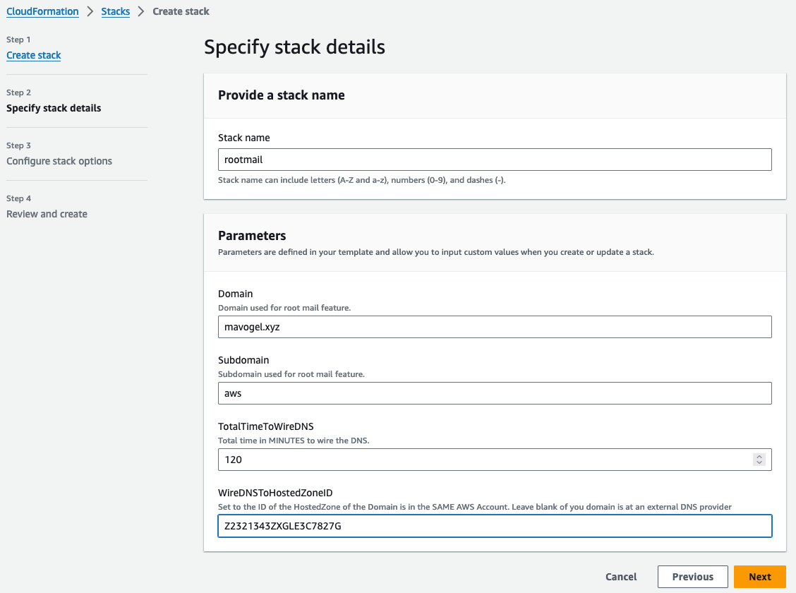
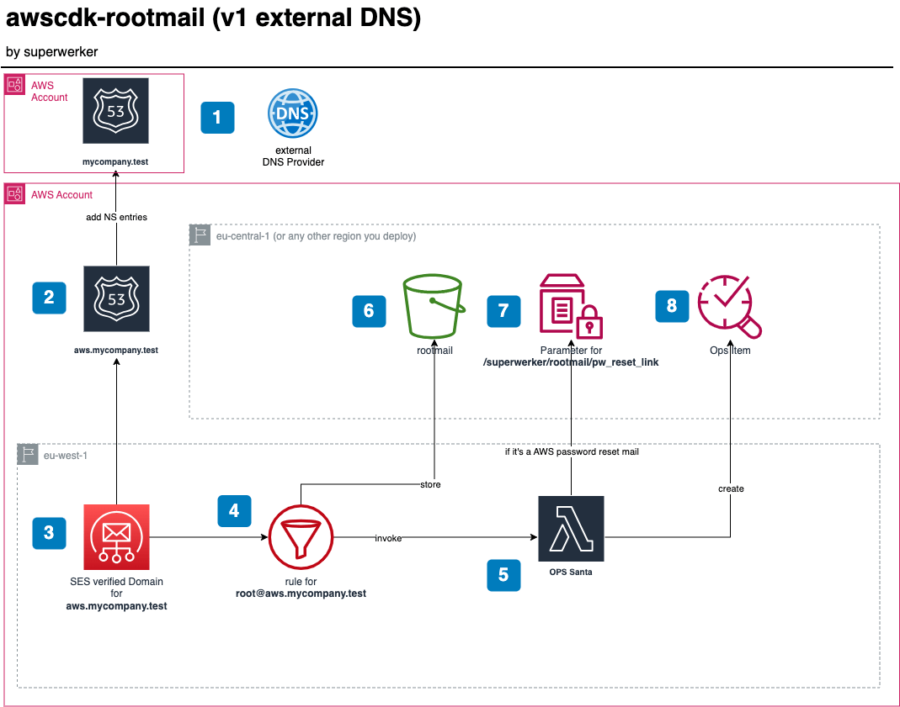
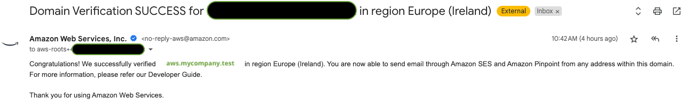
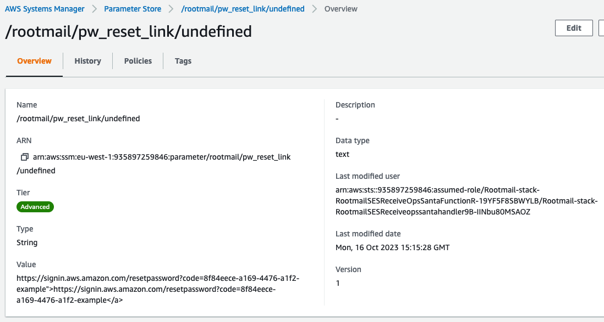
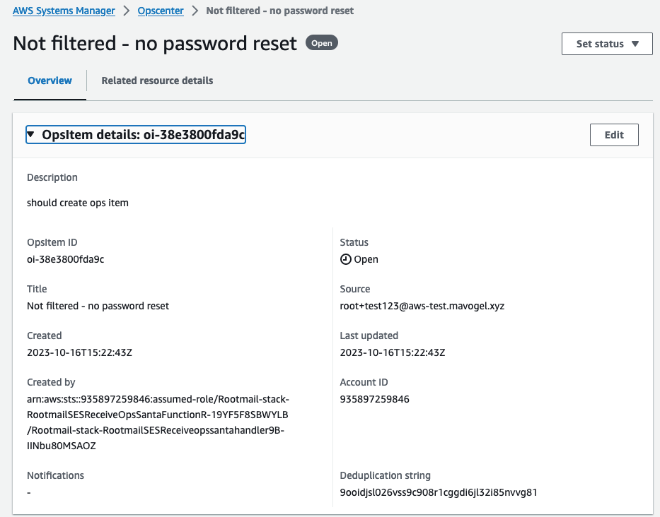
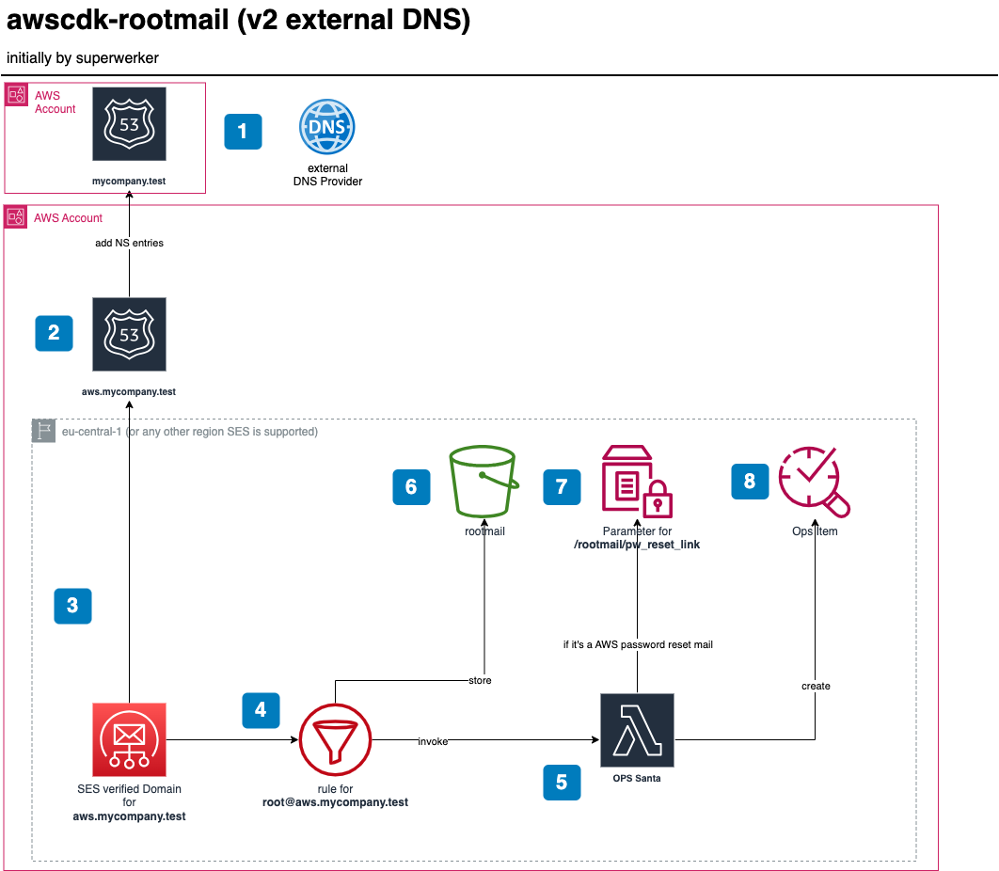
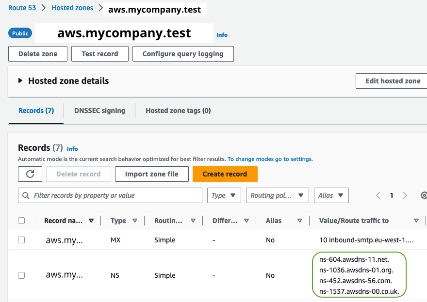
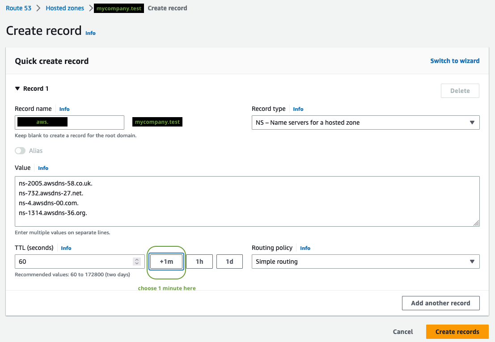
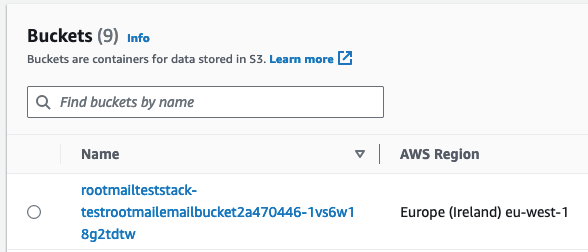
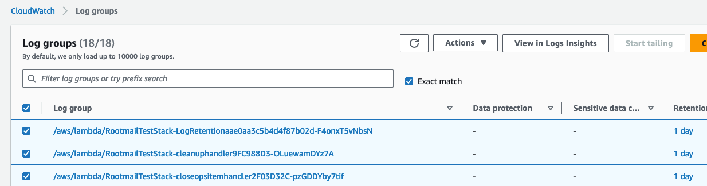

# awscdk-rootmail

A single rootmail box for all your AWS accounts. The cdk implementation and **adaption** of the [superwerker](https://superwerker.cloud/) rootmail feature. See [here](docs/adrs/rootmail.md) for a detailed Architectural Decision Record ([ADR](https://adr.github.io/))

- [TL;DR](#tldr)
- [Usage](#usage)
  - [Dependencies](#dependencies)
  - [Deploy](#deploy)
    - [CDK](#cdk)
    - [Cloudformation](#cloudformation)
- [Solution design: Version 1 - Domain in the same AWS account](#solution-design-version-1---domain-in-the-same-aws-account)
- [Solution design: Version 2 - external DNS provider](#solution-design-version-2---external-dns-provider)
- [Uninstall](#uninstall)
- [Known issues](#known-issues)
- [Related projects](#related-projects)

## TL;DR
Each AWS account needs one unique email address (the so-called "AWS account root user email address").

Access to these email addresses must be adequately secured since they provide privileged access to AWS accounts, such as account deletion procedures.

This is why you only need 1 mailing list for the AWS Management (formerly *root*) account, 
we recommend the following pattern `aws-roots+<uuid>@mycompany.test` 

> [!NOTE]
> Maximum **64** characters are allowed for the whole address. 

And as you own the domain `mycompany.test` you can add a subdomain, e.g. `aws`, for which all EMails will then be received with this solution within this particular AWS Management account.

## Usage
### Dependencies
Administrative access to an AWS account and the following tools:
```sh
brew install aws-cli node@18 esbuild
```

<details>
  <summary>... or a longer listing</summary>
  
- Access to a development environment.  It is recommended to use AWS Cloud9 to avoid having to set up the tools needed to deploy the solution.  See [Getting started with AWS Cloud9](https://aws.amazon.com/cloud9/getting-started/).
- Using Cloud9, all of the following have already been configured for you.  If you choose not to use Cloud9, you will need to install the following.
    - AWS CLI. See [Installing, updating and uninstalling the AWS CLI version 2](https://docs.aws.amazon.com/cli/latest/userguide/install-cliv2.html)
    - Set up the AWS CLI with IAM access credentials. See [Configuring the AWS CLI](https://docs.aws.amazon.com/cli/latest/userguide/cli-chap-configure.html)
    - Node.js version 10.13.0 or later
    - AWS CDK version 2.90.0 or later. For installation instructions see [Getting Started with the AWS CDK](https://docs.aws.amazon.com/cdk/latest/guide/getting_started.html#getting_started_install)
    - Docker version 20.10.x or later **OR** [esbuild](https://esbuild.github.io/)
</details>

### Deploy
You can chose via embedding the construct in your cdk-app or use is directly via Cloudformation.
#### CDK
1. To start a new project we recommend using [projen](https://projen.io/).
   1. Create a new projen project
   ```sh
   npx projen new awscdk-app-ts
   ```
   2. Add `@mavogel/awscdk-rootmail` as a dependency to your project in the `.projenrc.ts` file
   3. Run `npm run projen` to install it
2. In you `main.ts` file add the following code
```ts
import { 
    App, 
    Stack, 
    aws_route53 as r53 
} from 'aws-cdk-lib';
import { Rootmail } from '@mavogel/awscdk-rootmail';
import { Construct } from 'constructs';

export class MyStack extends Stack {
  constructor(scope: Construct, id: string, props: StackProps = {}) {
    super(scope, id, props);

    const domain = 'mycompany.test'

    const hostedZone = r53.HostedZone.fromLookup(this, 'rootmail-parent-hosted-zone', {
      domainName: domain,
    });

    const rootmail = new Rootmail(this, 'rootmail-stack', {
      // 1. a domain you own, registered via Route53 in the SAME account
      domain: domain;
      // 2. so the subdomain will be aws.mycompany.test and
      //    wired / delegated  automatically
      autowireDNSParentHostedZoneID: hostedZone.hostedZoneId,
      env: {
      // 3. or any other region SES is available
        region: 'eu-west-1',
      },
    }); 
  }
}
```
2. run on your commandline
```sh
npm run deploy
```
1. No need to do anything, the NS records are **automatically** propagated as the parent Hosted Zone is in the same account!
2. The `hosted-zone-dkim-propagation-provider.is-complete-handler` Lambda function checks every 10 seconds if the DNS for the subdomain is propagated. Details are in the Cloudwatch log group.

### CDK with your own receiver function
You might also want to pass in you own function on what to do when an EMail is received

file `functions/custom-ses-receive-function.ts` which gets the 2 environment variables populated
- `EMAIL_BUCKET`
- `EMAIL_BUCKET_ARN`

as well as `s3:GetObject` on the `RootMail/*` objects in the created Rootmail `S3` bucket. 

```ts
import { S3 } from '@aws-sdk/client-s3';
import { ParsedMail, simpleParser } from 'mailparser';
// populated by default
const emailBucket = process.env.EMAIL_BUCKET;
const emailBucketArn = process.env.EMAIL_BUCKET_ARN;
const s3 = new S3();

// SESEventRecordsToLambda
// from https://docs.aws.amazon.com/ses/latest/dg/receiving-email-action-lambda-event.html
export const handler = async (event: SESEventRecordsToLambda) => {
    for (const record of event.Records) {
        
        const id = record.ses.mail.messageId;
        const key = `RootMail/${id}`;
        const response = await s3.getObject({ Bucket: emailBucket as string, Key: key });
        
        const msg: ParsedMail = await simpleParser(response.Body as unknown as Buffer);
        
        let title = msg.subject;
        console.log(`Title: ${title} from emailBucketArn: ${emailBucketArn}`);
        // use the content of the email body 
        const body = msg.html;
        // add your custom code here ...

        // dummy example: list s3 buckets
        const buckets = await s3.listBuckets({});
        if (!buckets.Buckets) {
            console.log('No buckets found');
            return;
        }
        console.log('Buckets:');
        for (const bucket of buckets.Buckets || []) {
            console.log(bucket.Name);
        }
    }

};
```

```ts
const customSesReceiveFunction = new NodejsFunction(stackUnderTest, 'custom-ses-receive-function', {
  functionName: PhysicalName.GENERATE_IF_NEEDED,
  entry: path.join(__dirname, 'functions', 'custom-ses-receive-function.ts'),
  runtime: lambda.Runtime.NODEJS_18_X,
  logRetention: 1,
  timeout: Duration.seconds(30),
});

// Note: any additional permissions you need to add to the function yourself!
customSesReceiveFunction.addToRolePolicy(new iam.PolicyStatement({
  actions: [
    's3:List*',
  ],
  resources: ['*'],
}))
```

#### Cloudformation
or use it directly a Cloudformation template `yaml` from the URL [here](https://mvc-test4-bucket-eu-west-1.s3.eu-west-1.amazonaws.com/rootmail/0.0.13-DEVELOPMENT/rootmailStack.template.yaml).


<details>
  <summary>... click to expand</summary>

and fill out the parameters


</details>

## Solution design: Version 1 - Domain in the same AWS account


1. You own a domain, e.g., `mycompany.test`, registered via `Route53` in the **same** AWS account.
2. The stack creates a `Route53` public Hosted Zone for the subdomain, e.g., `aws.mycompany.test`. It also automatically adds the `TXT` and `CNAME` records for verifying the domain towards SES **and** adds the NS server entries automatically to the main domain `mycompany.test`.
3. When the subdomain `aws.mycompany.test` is successfully propagated, the stack creates a verified Domain in AWS SES and adds a recipient rule for `root@aws.mycompany.test`. On a successful propagation you will get a mail as follows to the root Email address of the account you are installing the stack 👇

4. Now, any mail going to `root+<any-string>@aws.mycompany.test` will be processed by OpsSanta 🎅🏽 Lambda function and also stored in the rootmail S3 bucket 🪣.
5. The OpsSanta function verifies the verdicts (DKIM etc.) of the sender, also skips AWS Account welcome EMails, and processes all other EMails. If it is a password reset link EMail it stores the link in the parameter store (and does *not* create an OpsItem for now). For all other mails, which are not skipped an OpsItem is created to have a central location for all items. 
> [!NOTE]
> You can also connect your Jira to the OpsCenter.
6. The bucket where all mail to `root@aws.mycompany.test` are stored.
7. The [SSM parameter store](https://docs.aws.amazon.com/systems-manager/latest/userguide/systems-manager-parameter-store.html) for the password reset links.

8. The OpsItem which is created. It is open and shall be further processed either in the OpsCenter or any other issue tracker.


> [!NOTE]
> SES support alias, so mail to `root+random-string@aws.mycompany.test` will also be catched and forwarded.

## Solution design: Version 2 - external DNS provider
<details>
  <summary>open for details</summary>



```ts
const rootmail = new Rootmail(this, 'rootmail-stack', {
  // 1. a domain you own, registered via Route53 in the same account
  domain: 'mycompany.test';
  // 2. '' is the default, so you can also remove it
  // autowireDNSParentHostedZoneID: '',
  env: {
  // 3. or any other region SES is available
    region: 'eu-west-1',
  },
});
```

1. You own a domain, e.g., `mycompany.test`. It can be at any registrar such as `godaddy`, also `Route53` itself in another AWS account.
2. The stack creates a `Route53` public Hosted Zone for the subdomain, e.g., `aws.mycompany.test`. It also automatically adds the TXT and CNAME records (for DKIM etc.) for verifying the domain towards SES. **NOTE:** You must now add the NS server entries into the Domain provider which owns the main domain `mycompany.test`. 
3. items 3-7 are the same as in `v1`


> [!NOTE]
> After running `npm run deploy` you need to do the following steps manually:

1. watch out for the hosted zone  `aws.mycompany.test` to be created
 By default you have **2 hours** to wire the DNS!
2. Then create the NS record in your domain `mycompany.test` for the subdomain `aws.mycompany.test`. Here for Route53 in AWS:

3. You can test it yourself via
```sh
dig +short NS 8.8.8.8 aws.mycompany.test
# should return something like 
ns-1111.your-dns-provider-10.org.
ns-2222.your-dns-provider-21.co.uk.
ns-33.your-dns-provider-04.com.
ns-444.your-dns-provider-12.net.
```
and also by sending an EMail, e.g. from Gmail to `root@aws.mycompany.test`

</details>

## Uninstall
1. Delete the stack, the custom resources will delete most resources
2. And by design you need to manually delete the S3 Bucket containing the mails. This is to prevent accidental deletion of the mails. You can find the bucket name in the stack output.

3. Furthermore, the cloudwatch log groups are not deleted, since they might contain valuable information. You can delete them manually.

## Known issues
- [jsii/2071](https://github.com/aws/jsii/issues/2071): so adding  `compilerOptions."esModuleInterop": true,` in `tsconfig.json` is not possible. See aws-cdk usage with[typescript](https://docs.aws.amazon.com/AWSJavaScriptSDK/latest/#Usage_with_TypeScript). So we needed to change import from `import AWS from 'aws-sdk';` -> `import * as AWS from 'aws-sdk';` to be able to compile.

## Related projects
- [aws-account-factory-email](https://github.com/aws-samples/aws-account-factory-email): a similar approach with SES, however you need to manually configure it upfront and also it about delivering root mails for a specific account to a specific mailing list and mainly decouples the real email address from the one of the AWS account. The main difference is that we do not *hide* or decouple the email address, but more make those as unique and unguessable/bruteforable as possible (with `uuids`).