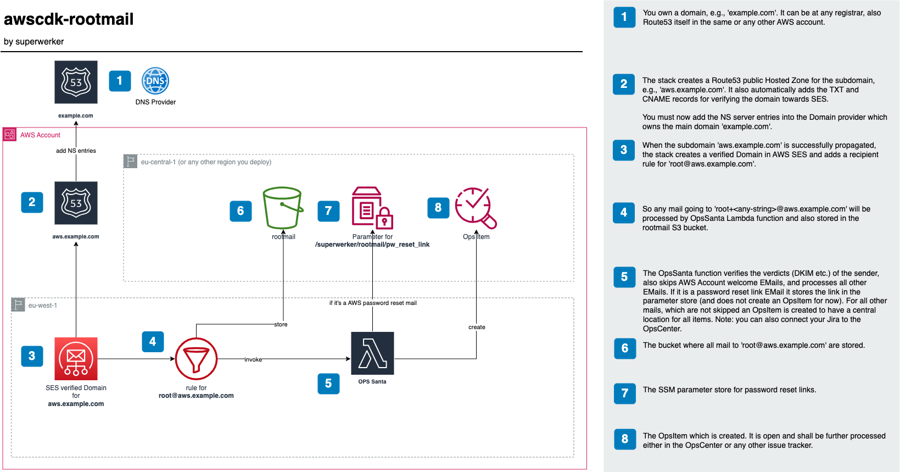

# awscdk-rootmail

See the ADR from superwerker about the rootmail feature [here](https://github.com/superwerker/superwerker/blob/main/docs/adrs/rootmail.md)

## Solution diagram

## Setup
1. In you `main.ts`
```ts
import { App, Stack, StackProps } from 'aws-cdk-lib';
import { Rootmail, SESReceiveStack } from 'awscdk-rootmail';
import { Construct } from 'constructs';

export class MyStack extends Stack {
  constructor(scope: Construct, id: string, props: StackProps = {}) {
    super(scope, id, props);

    const domain = 'example.com'; // a domain you need to own
    const subdomain = 'aws'; // subdomain which will be created
    
    const rootmail = new Rootmail(this, 'rootmail-stack', {
      domain: domain,
      subdomain: subdomain,
    });

    new SESReceiveStack(this, 'ses-receive-stack', {
      domain: domain,
      subdomain: subdomain,
      emailbucket: rootmail.emailBucket,
      // SES only supports receiving in certain regions
      // https://docs.aws.amazon.com/ses/latest/dg/regions.html#region-receive-email
      env: {
        region: 'eu-west-1',
      },
    });
  }
}
```
2. run on your commandline
```sh
# projen
npm run deploy -- --all
# plain cdk
npx cdk deploy --all
```
3. watch our for the [cfn wait condition](https://docs.aws.amazon.com/AWSCloudFormation/latest/UserGuide/aws-properties-waitcondition.html)

4. Then create the NS record in your domain `example.com` for the subdomain `aws.example.com`. Here for Route53 in AWS:

5. The `rootmail-ready-handler` Lambda function checks every 5 minutes if the DNS for the subdomain is propagated. You can test it yourself via
```sh
dig +short NS 8.8.8.8 aws.example.com
# should return something like
ns-1111.awsdns-10.org.
ns-2222.awsdns-21.co.uk.
ns-33.awsdns-04.com.
ns-444.awsdns-12.net.
```

## Known issues
- https://github.com/aws/jsii/issues/2071: so adding  `compilerOptions."esModuleInterop": true,` in `tsconfig.json` is not possible. See [aws-sdk](https://docs.aws.amazon.com/AWSJavaScriptSDK/latest/#Usage_with_TypeScript). So change from `import AWS from 'aws-sdk';` to `import * as AWS from 'aws-sdk';`

## Docs
- activate opscenter via [url](https://eu-central-1.console.aws.amazon.com/systems-manager/opsitems/?region=eu-central-1&onboarded=true#activeTab=OPS_ITEMS&list_ops_items_filters=Status:Equal:Open_InProgress)