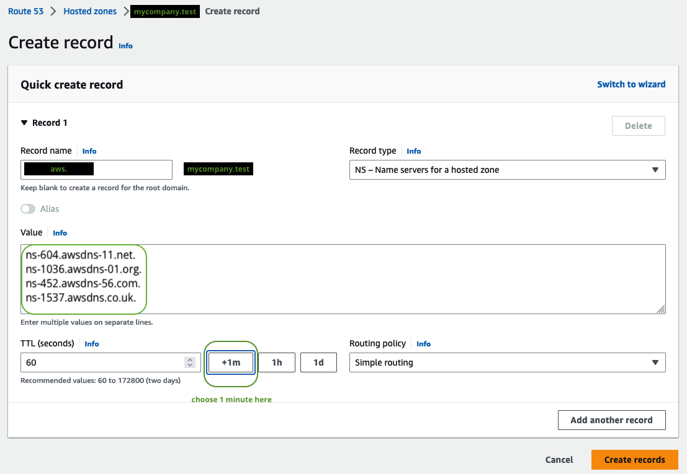

# awscdk-rootmail

A single rootmail box for all your AWS accounts. The cdk implementation of the [superwerker](https://superwerker.cloud/) rootmail feature. See [here](https://github.com/superwerker/superwerker/blob/main/docs/adrs/rootmail.md) for a detailed Architectural Decision Record ([ADR](https://adr.github.io/))

## TL;DR
Each AWS account needs one unique email address (the so-called "AWS account root user email address").

Access to these email addresses must be adequately secured since they provide privileged access to AWS accounts, such as account deletion procedures.

This is why you only need 1 mailing list for the AWS Management (formerly *root*) account, we recommend `aws-roots+<uuid>@mycompany.test` (**NOTE:** maximum 64 character are allowed for the whole address). And as you own the domain `mycompany.test` you can add a subdomain, e.g. `aws`, for which all EMails will then be received with this solution within this particular AWS Management account.

## Prerequisites
- Administrative access to an AWS account  
- Access to a development environment.  It is recommended to use AWS Cloud9 to avoid having to set up the tools needed to deploy the solution.  See [Getting started with AWS Cloud9](https://aws.amazon.com/cloud9/getting-started/).
- Using Cloud9, all of the following have already been configured for you.  If you choose not to use Cloud9, you will need to install the following.
    - AWS CLI. See [Installing, updating and uninstalling the AWS CLI version 2](https://docs.aws.amazon.com/cli/latest/userguide/install-cliv2.html)
    - Set up the AWS CLI with IAM access credentials. See [Configuring the AWS CLI](https://docs.aws.amazon.com/cli/latest/userguide/cli-chap-configure.html)
    - Node.js version 10.13.0 or later
    - AWS CDK version 2.90.0 or later. For installation instructions see [Getting Started with the AWS CDK](https://docs.aws.amazon.com/cdk/latest/guide/getting_started.html#getting_started_install)
    - Docker version 20.10.x or later

## Solution design: Version 1 - external DNS provider


1. You own a domain, e.g., `mycompany.test`. It can be at any registrar such as `godaddy`, also `Route53` itself in another AWS account.
2. The stack creates a `Route53` public Hosted Zone for the subdomain, e.g., `aws.mycompany.test`. It also automatically adds the TXT and CNAME records (for DKIM etc.) for verifying the domain towards SES. **NOTE:** You must now add the NS server entries into the Domain provider which owns the main domain `mycompany.test`. 
3. When the subdomain `aws.mycompany.test` is successfully propagated, the stack creates a verified Domain in AWS SES and adds a recipient rule for `root@aws.mycompany.test`. **NOTE:** SES support alias, so mail to `root+random-string@aws.mycompany.test` will also be catched and forwared. On a successfull propagation you will get a mail as follows to the root Email address of the account you are installing the stack

1. Now, any mail going to `root+<any-string>@aws.mycompany.test` will be processed by OpsSanta 🎅🏽 Lambda function and also stored in the rootmail S3 bucket 🪣.
2. The OpsSanta function verifies the verdicts (DKIM etc.) of the sender, also skips AWS Account welcome EMails, and processes all other EMails. If it is a password reset link EMail it stores the link in the parameter store (and does *not* create an OpsItem for now). For all other mails, which are not skipped an OpsItem is created to have a central location for all items. Note: you can also connect your Jira to the OpsCenter.
3. The bucket where all mail to `root@aws.mycompany.test` are stored.
4. The SSM parameter store for password reset links.
5. The OpsItem which is created. It is open and shall be further processed either in the OpsCenter or any other issue tracker.

### Setup v1
1. To start a new project we recommend using [projen](https://projen.io/).
   1. Create a new projen project
   ```sh
   npx projen new awscdk-app-ts
   ```
   2. Add `@mavogel/awscdk-rootmail` as a dependency to your project in the `.projenrc.ts` file
   3. Run `npm run projen` to install it
2. In you `main.ts` file add the following
```ts
import { App, Stack, StackProps } from 'aws-cdk-lib';
import { Rootmail, SESReceiveStack } from 'awscdk-rootmail';
import { Construct } from 'constructs';

export class MyStack extends Stack {
  constructor(scope: Construct, id: string, props: StackProps = {}) {
    super(scope, id, props);

    const domain = 'mycompany.test'; // a domain you need to own
    const subdomain = 'aws'; // subdomain which will be created
    const rootMailDeployRegion = 'eu-central-1';
    
    const rootmail = new Rootmail(this, 'rootmail-stack', {
      domain: domain,
      subdomain: subdomain,
      env: {
        region: rootMailDeployRegion,
      },
    });

    new SESReceiveStack(this, 'ses-receive-stack', {
      domain: domain,
      subdomain: subdomain,
      emailbucket: rootmail.emailBucket,
      rootMailDeployRegion: rootMailDeployRegion,
      // SES only supports receiving in certain regions
      // https://docs.aws.amazon.com/ses/latest/dg/regions.html#region-receive-email
      env: {
        region: 'eu-west-1',
      },
    });
  }
}
```
2. run on your commandline
```sh
docker ps # need to be running to build lambdas with esbuild
npm run deploy -- --all
```
3. watch our for the [cfn wait condition](https://docs.aws.amazon.com/AWSCloudFormation/latest/UserGuide/aws-properties-waitcondition.html)
 By default you have **8 hours** to wire the DNS!
4. Then create the NS record in your domain `mycompany.test` for the subdomain `aws.mycompany.test`. Here for Route53 in AWS:

5. The `rootmail-ready-handler` Lambda function checks every **5 minutes** if the DNS records for the subdomain are propagated. 

### Verify
You can test it yourself via
```sh
dig +short NS 8.8.8.8 aws.mycompany.test
# should return something like 
ns-1111.your-dns-provider-10.org.
ns-2222.your-dns-provider-21.co.uk.
ns-33.your-dns-provider-04.com.
ns-444.your-dns-provider-12.net.
```
and also by sending an EMail, e.g. from Gmail to `root@aws.mycompany.test`

## Solution design: Version 2 - Domain in the same AWS account


1. You own a domain, e.g., `mycompany.test`, registered via `Route53` in the **same** AWS account.
2. The stack creates a `Route53` public Hosted Zone for the subdomain, e.g., `aws.mycompany.test`. It also automatically adds the TXT and CNAME records for verifying the domain towards SES **and** adds the NS server entries automatically to the main domain `mycompany.test`. (**NOTE:** you can still do this manually if desired, as described in `v1` above)
3. items 3-7 are the same as in `v1`

### Setup v2
1. To start a new project we recommend using [projen](https://projen.io/).
   1. Create a new projen project
   ```sh
   npx projen new awscdk-app-ts
   ```
   2. Add `@mavogel/awscdk-rootmail` as a dependency to your project in the `.projenrc.ts` file
   3. Run `npm run projen` to install it
2. In you `main.ts` file add the following
```ts
import { App, Stack, StackProps, Duration } from 'aws-cdk-lib';
import { Rootmail, SESReceiveStack } from 'awscdk-rootmail';
import { Construct } from 'constructs';

export class MyStack extends Stack {
  constructor(scope: Construct, id: string, props: StackProps = {}) {
    super(scope, id, props);

    const domain = 'mycompany.test'; // a domain you need to own
    const subdomain = 'aws'; // subdomain which will be created
    const rootMailDeployRegion = 'eu-central-1';
    
    const rootmail = new Rootmail(this, 'rootmail-stack', {
      domain: domain,
      subdomain: subdomain,
      // NEW start (compared to v1)
      totalTimeToWireDNS: Duration.minutes(40),                    // <- NEW: time can be reduced
      autowireDNSOnAWSEnabled: true,                               // <- NEW: enable autowire
      autowireDNSOnAWSParentHostedZoneId: 'Z09999999TESTE1A2B3C4D', // <- NEW the id for 'mycompany.test'
      // NEW end
      env: {
        region: rootMailDeployRegion,
      },
    });

    new SESReceiveStack(this, 'ses-receive-stack', {
      domain: domain,
      subdomain: subdomain,
      emailbucket: rootmail.emailBucket,
      rootMailDeployRegion: rootMailDeployRegion,
      // SES only supports receiving in certain regions
      // https://docs.aws.amazon.com/ses/latest/dg/regions.html#region-receive-email
      env: {
        region: 'eu-west-1',
      },
    });
  }
}
```
2. run on your commandline
```sh
docker ps # need to be running to build lambdas with esbuild
npm run deploy -- --all
```
1. No need to do anything when you see the [cfn wait condition](https://docs.aws.amazon.com/AWSCloudFormation/latest/UserGuide/aws-properties-waitcondition.html). The NS records are **automatically** propagated!

1. The `rootmail-ready-handler` Lambda function checks every 5 minutes if the DNS for the subdomain is propagated. 

## Known issues
- https://github.com/aws/jsii/issues/2071: so adding  `compilerOptions."esModuleInterop": true,` in `tsconfig.json` is not possible. See [aws-sdk](https://docs.aws.amazon.com/AWSJavaScriptSDK/latest/#Usage_with_TypeScript). So change from `import AWS from 'aws-sdk';` to `import * as AWS from 'aws-sdk';`

## Docs
- activate opscenter via [url](https://eu-central-1.console.aws.amazon.com/systems-manager/opsitems/?region=eu-central-1&onboarded=true#activeTab=OPS_ITEMS&list_ops_items_filters=Status:Equal:Open_InProgress)