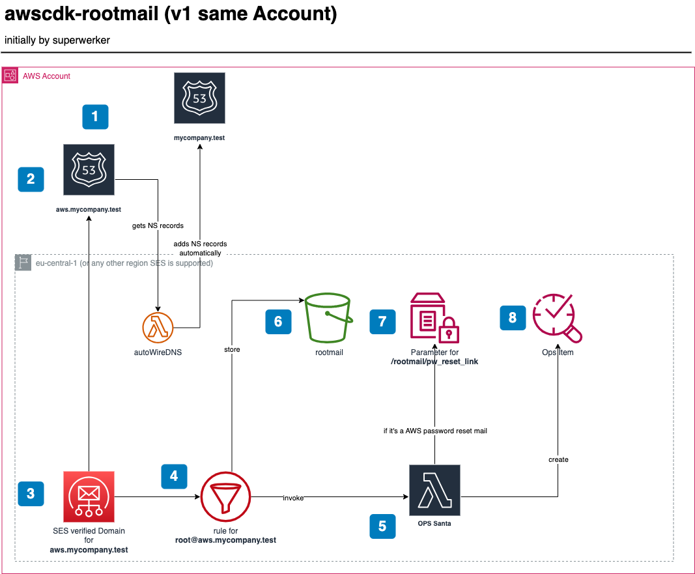

# Solution design - Domain in the same AWS account

## Design

## Steps

1. You own a domain, e.g., `mycompany.test`, registered via `Route53` in the **same** AWS account.
2. The stack creates a `Route53` public Hosted Zone for the subdomain, e.g., `aws.mycompany.test`. It also automatically adds the `TXT` and `CNAME` records for verifying the domain towards SES **and** adds the NS server entries automatically to the main domain `mycompany.test`.
3. When the subdomain `aws.mycompany.test` is successfully propagated, the stack creates a verified Domain in AWS SES and adds a recipient rule for `root@aws.mycompany.test`. On a successful propagation you will get a mail as follows to the root Email address of the account you are installing the stack 👇

4. Now, any mail going to `root+<any-string>@aws.mycompany.test` will be processed by OpsSanta 🎅🏽 Lambda function and also stored in the rootmail S3 bucket 🪣.
5. The OpsSanta function verifies the verdicts (DKIM etc.) of the sender, also skips AWS Account welcome EMails, and processes all other EMails. If it is a password reset link EMail it stores the link in the parameter store (and does *not* create an OpsItem for now). For all other mails, which are not skipped an OpsItem is created to have a central location for all items. 
> [!NOTE]
> You can also connect your Jira to the OpsCenter.
6. The bucket where all mail to `root@aws.mycompany.test` are stored.
7. The [SSM parameter store](https://docs.aws.amazon.com/systems-manager/latest/userguide/systems-manager-parameter-store.html) for the password reset links.

8. The OpsItem which is created. It is open and shall be further processed either in the OpsCenter or any other issue tracker.

> [!NOTE]
> SES support alias, so mail to `root+random-string@aws.mycompany.test` will also be catched and forwarded.