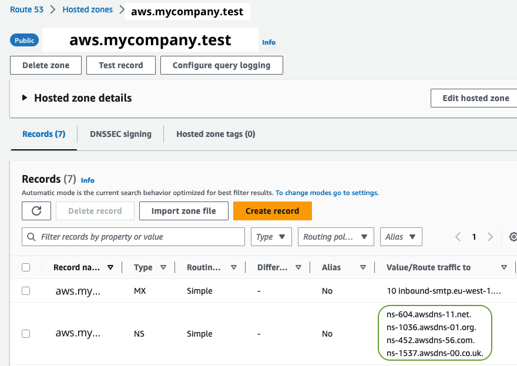

# Solution design: external DNS provider

## Design


## Steps for implementation
```ts
const rootmail = new Rootmail(this, 'rootmail-stack', {
  // 1. a domain you own, registered via Route53 in the same account
  domain: 'mycompany.test';
  // 2. '' is the default, so you can also remove it
  // autowireDNSParentHostedZoneID: '',
  env: {
  // 3. or any other region SES is available
    region: 'eu-west-1',
  },
});
```

1. You own a domain, e.g., `mycompany.test`. It can be at any registrar such as `godaddy`, also `Route53` itself in another AWS account.
2. The stack creates a `Route53` public Hosted Zone for the subdomain, e.g., `aws.mycompany.test`. It also automatically adds the TXT and CNAME records (for DKIM etc.) for verifying the domain towards SES. **NOTE:** You must now add the NS server entries into the Domain provider which owns the main domain `mycompany.test`. 
3. items 3-7 are the same as in `v1`


> [!NOTE]
> After running `yarn run deploy` you need to do the following steps manually:

1. watch out for the hosted zone  `aws.mycompany.test` to be created
 By default you have **2 hours** to wire the DNS!
2. Then create the NS record in your domain `mycompany.test` for the subdomain `aws.mycompany.test`. Here for Route53 in AWS:

3. You can test it yourself via
```sh
dig +short NS 8.8.8.8 aws.mycompany.test
# should return something like 
ns-1111.your-dns-provider-10.org.
ns-2222.your-dns-provider-21.co.uk.
ns-33.your-dns-provider-04.com.
ns-444.your-dns-provider-12.net.
```
and also by sending an EMail, e.g. from Gmail to `root@aws.mycompany.test`

</details>
